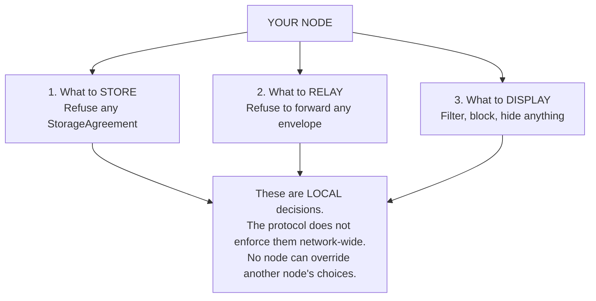
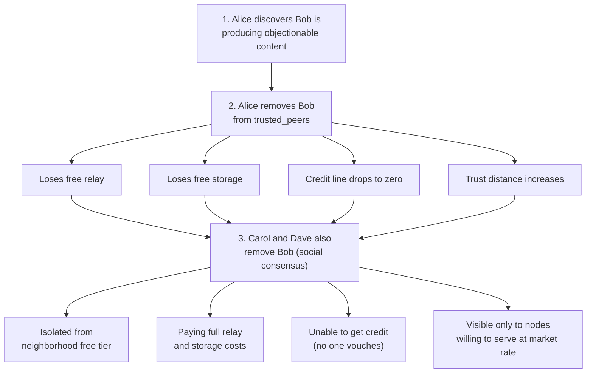
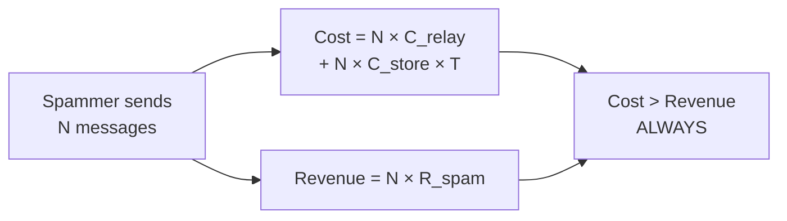
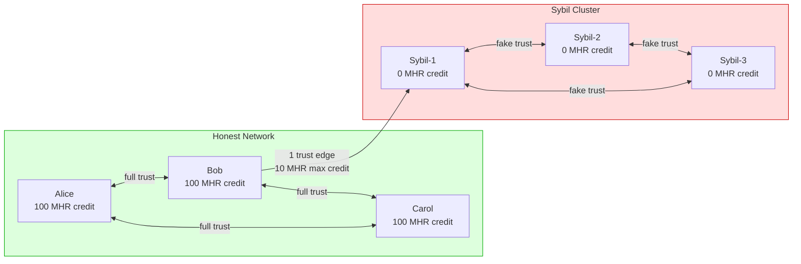
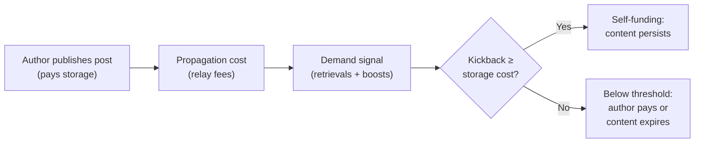
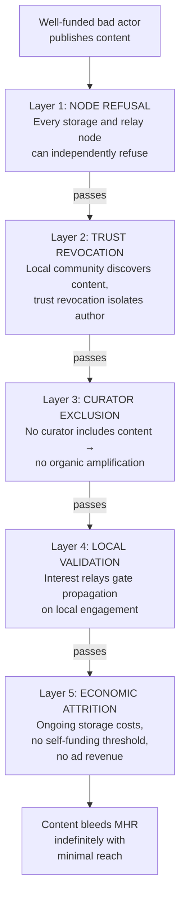

# Content Governance

Mehr has no content moderation, no terms of service, and no central authority that decides what is allowed. Content governance is distributed: every node makes its own decisions about what to store, relay, and display. Censorship resistance and content governance are the same mechanism — **node sovereignty**.

## Node Autonomy

Every node has absolute control over three decisions:



**Storing**: A storage node can refuse any [StorageAgreement](../services/mhr-store#storage-agreements) for any reason. No node is compelled to host content it objects to. The agreement is bilateral — both parties must consent.

**Relaying**: A relay node can inspect [PostEnvelope](../applications/social#postenvelope-free-layer) metadata and refuse to forward specific content. This is a local routing policy, not protocol enforcement. The node still relays other traffic normally.

**Displaying**: Client software can filter, block, or hide content based on any criteria — author blocklists, content-type filters, community norms, or user preferences. This happens entirely on the reader's device.

## Content Filtering

### Envelope-Based Filtering

PostEnvelopes contain metadata that nodes can use for filtering without fetching paid content:

| Envelope Field | Filtering Use |
|---------------|--------------|
| `scopes` | Block specific topics or geographic areas |
| `author` | Block specific authors (local blocklist) |
| `media_hints.content_type` | Block specific media types (e.g., refuse video) |
| `content_size` | Refuse to relay objects above a size threshold |
| `references` | Block content referencing known-bad posts |

A relay node's filtering policy is expressed as local configuration, not as a protocol message. Other nodes don't know what you filter — they only notice that you don't relay certain content.

### Trust-Based Enforcement

The most powerful governance mechanism is the [trust graph](trust-neighborhoods):



This mirrors real-world community enforcement. If your neighbors find your behavior unacceptable, they stop helping you. Nobody passes a law — social consequences are sufficient. The economic impact of trust revocation is real: lost credit lines, lost free relay, lost free storage.

### Community Norms

Communities can establish shared content policies through social consensus:

- "Our trust neighborhood doesn't relay content tagged with X"
- "Nodes that relay Y will be removed from trusted peers"
- "Our curators don't include Z in their feeds"

These are enforced through trust relationships, not protocol rules. A node that violates community norms faces trust revocation — which has economic consequences. No formal governance or voting is needed for communities to establish and enforce norms.

## Why Illicit Content Is Harder on Mehr

| Factor | Regular Internet | Mehr |
|--------|-----------------|------|
| **Cost to publish** | Free (anonymous upload) | Author pays storage per epoch |
| **Author identity** | Anonymous (VPN, Tor, throwaway accounts) | NodeID attached; author known to local cluster |
| **Hosting** | Bulletproof hosting services exist | Every storage node can independently refuse |
| **Distribution** | Global CDN, unlimited free copies | [Local-first propagation](propagation#local-first-interest-propagation); global reach requires demand or payment |
| **Amplification** | Algorithms promote engagement | No algorithm — only human curators and boosts |
| **Social consequences** | None (anonymous) | Trust revocation, credit loss, neighborhood isolation |
| **Takedown** | Centralized (platform compliance) | Distributed (each node independently decides) |

### What Economics Limits

```
Economic barriers to abuse:

  Spam:
    Cost to post: N μMHR per epoch
    Revenue from spam: ~0 (nobody reads it)
    Result: economically irrational

  Low-demand illicit content:
    Cost to store: N μMHR per epoch (ongoing)
    Readership: small (niche audience)
    Kickback: below self-funding threshold
    Result: author pays indefinitely or content expires

  Automated distribution (bots):
    Bot needs MHR → must earn through service OR purchase
    Each bot post costs storage
    Local-first propagation means no automatic global reach
    Result: expensive and slow compared to internet-scale abuse

  Mass distribution:
    Local validation gates interest propagation
    Content needs real engagement (boosts, retrievals, curation)
    before reaching distant clusters
    Result: garbage can't go viral without genuine demand
```

### Formal Economic Model

**Spam Unprofitability Proof:**



```
Spam profitability:
  Cost_spam = N × C_relay + N × C_store × T
  Revenue_spam = N × R_spam

  Profitable only if: R_spam > C_relay + C_store × T

  In Mehr:
    R_spam → 0 (client-side filtering, no algorithmic amplification)
    C_relay > 0 (paid relay for non-trusted traffic)
    C_store > 0 (ongoing per-epoch storage cost)

  Therefore: Cost > Revenue always. Spam is unprofitable at any scale.
```

**Trust-Flow Sybil Resistance:**



The honest network has full mutual credit. The Sybil cluster has zero internal credit (no real economic backing). Even with one trust edge from Bob, Sybil-1 gets at most `transitive_credit_ratio × Bob's limit` — and Sybil-2 and Sybil-3 get nothing (3+ hops = no credit). Creating more Sybils doesn't increase available credit.

**Content Lifecycle Economic Model:**



### What Economics Doesn't Limit

A determined, well-funded group willing to pay high storage and relay costs can distribute content through the paid economy. The protocol does not prevent this.

The defense layers for this scenario:



This is the same tradeoff every free society makes: some bad actors will misuse freedom. The alternative — giving any central authority the power to decide what's allowed — creates a worse problem. Mehr is more resistant than centralized platforms to censorship, but also more resistant to centralized takedown. Both properties come from the same design: node sovereignty.

## Not Censorship

Refusing to store or relay content is **not censorship** — it is individual autonomy.

```
Censorship:
  A central authority prevents content from existing or
  being accessed ANYWHERE on the network.
  → Impossible on Mehr (no central authority exists)

Node autonomy:
  An individual node chooses not to participate in
  distributing specific content.
  → Always possible on Mehr (every node is sovereign)
```

On Mehr, no single node can prevent content from existing. It can only refuse to help distribute it. If even one node in the network is willing to store and relay the content, it remains accessible to anyone willing to pay the relay costs to reach it. The author's freedom to publish and the node's freedom to refuse coexist without contradiction.

## Comparison With Other Models

| | Centralized Platform | Polycentric (ActivityPub) | Mehr |
|---|---|---|---|
| **Who decides** | Platform moderation team | Server administrator | Each node independently |
| **Enforcement** | Account ban, content removal | Server defederation | Trust revocation, storage/relay refusal |
| **Scope** | Global (platform-wide) | Per-server | Per-node |
| **Appeal** | Platform's discretion | Server operator's discretion | None needed (find a willing node) |
| **Collateral damage** | Affects all users on platform | Affects all users on defederated server | Affects only the specific node |
| **Can content survive?** | No (platform removes it) | Maybe (other servers may host) | Yes (if any node is willing) |
| **Can node refuse?** | N/A (users don't run nodes) | Yes (server operator decides) | Yes (every node operator decides) |
