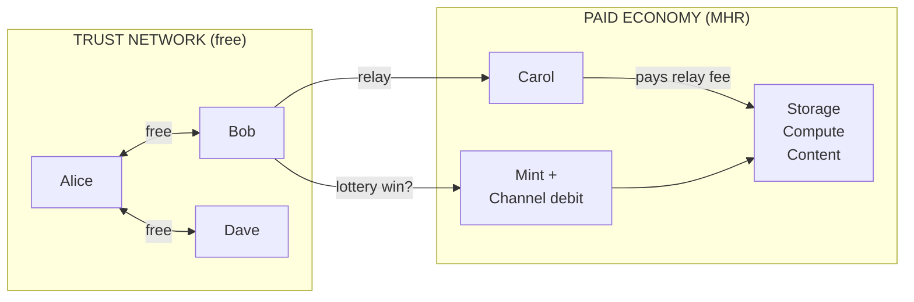
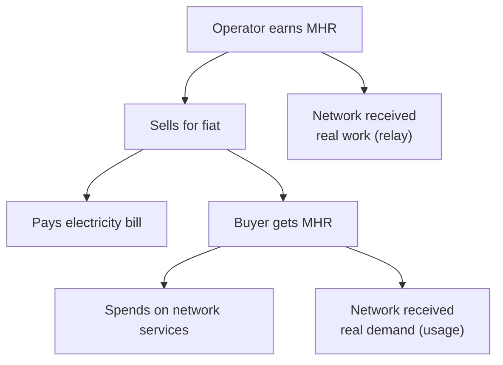
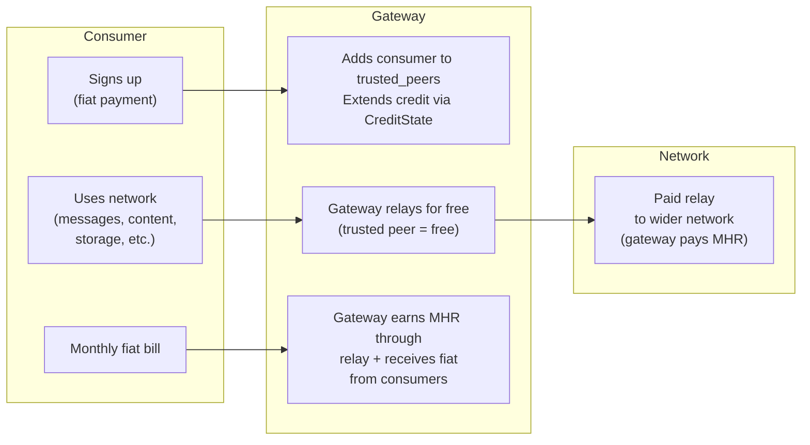

# MHR Token

MHR is the unit of account for the Mehr network. It is not a speculative asset — it is the internal currency for purchasing capabilities from nodes outside your trust network.

## Properties

```
MHR Properties:
  Smallest unit: 1 μMHR (micro-MHR)
  Initial distribution: Genesis service allocation + demand-backed proof-of-service mining (no ICO)
  Genesis allocation: Disclosed amount to genesis gateway operator (see Genesis below)
  Supply ceiling: 2^64 μMHR (~18.4 × 10^18 μMHR, asymptotic — never reached)
```

### Supply Model

MHR has an **asymptotic supply ceiling** with **decaying emission**:

| Phase | Epoch Range | Emission Per Epoch |
|-------|-------------|-------------------|
| Bootstrap | 0–99,999 | 10^12 μMHR (1,000,000 MHR) |
| Halving 1 | 100,000–199,999 | 5 × 10^11 μMHR |
| Halving 2 | 200,000–299,999 | 2.5 × 10^11 μMHR |
| Halving N | N × 100,000 – (N+1) × 100,000 − 1 | 10^12 × 2^(−N) μMHR |
| Tail | When halved reward is below floor | 0.1% of circulating supply / estimated epochs per year |

```
Emission formula:
  halving_shift = min(e / 100_000, 63)   // clamp to prevent undefined behavior
  epoch_reward(e) = max(
    10^12 >> halving_shift,              // discrete halving (bit-shift)
    circulating_supply * 0.001 / E_year  // tail floor
  )

  E_year = trailing 1,000-epoch moving average of epoch frequency
  Halving is epoch-counted, not wall-clock (partition-safe)
  At ~1 epoch per 10 minutes: 100,000 epochs ≈ 1.9 years

  Implementation note: the shift operand MUST be clamped to 63 (max
  for u64). At epoch 6,400,000 (~year 1218), unclamped shift = 64
  which is undefined behavior on most platforms. Clamping to 63 yields
  0 (10^12 >> 63 = 0), so the tail floor takes over — correct behavior.
```

The theoretical ceiling is 2^64 μMHR, but it is never reached — tail emission asymptotically approaches it. The initial reward of 10^12 μMHR/epoch yields ~1.5% of the supply ceiling minted in the first halving period, providing strong bootstrap incentive. Discrete halving every 100,000 epochs is epoch-counted (no clock synchronization needed) and trivially computable via bit-shift on integer-only hardware.

The tail ensures ongoing proof-of-service rewards exist indefinitely, funding relay and storage operators. In practice, lost keys (estimated 1–2% of supply annually) offset tail emission, keeping effective circulating supply roughly stable after year ~10.

### Typical Costs

| Operation | Cost |
|-----------|------|
| Expected relay cost per packet | ~5 μMHR |
| Relay lottery payout (on win) | ~500 μMHR (5 μMHR ÷ 1/100 win probability) |
| Expected cost: 1 KB message, 5 hops | ~75 μMHR (~3 packets × 5 μMHR × 5 hops) |
| 1 hour of storage (1 MB) | ~50 μMHR |
| 1 minute of compute (contract execution) | ~30–100 μMHR |

The relay lottery pays out infrequently but in larger amounts. Expected value per packet is the same: `500 μMHR × 1/100 = 5 μMHR`. See [Stochastic Relay Rewards](payment-channels) for the full mechanism.

## Why Relay-Only Minting

Only relay earns minting rewards. Storage and compute earn through bilateral payments, not minting. This is deliberate.

```
Service minting analysis:

  Relay:    ✓ Minting reward (VRF lottery, demand-backed)
            VRF prevents grinding — exactly one output per (relay, packet) pair.
            But VRF alone does NOT prevent traffic fabrication: a Sybil attacker
            can fabricate traffic between colluding nodes and run the VRF lottery
            on fake packets. The actual Sybil defense is demand-backed minting:
            VRF wins only count for minting if the packet traversed a funded
            payment channel. Fabricating funded-channel traffic requires spending
            real MHR, and revenue-capped minting ensures the attacker always
            loses money (see Revenue-Capped Minting below).

  Storage:  ✗ No minting reward
            Storage proofs can be gamed: store your own garbage data,
            respond to your own challenges, claim minting. A bilateral
            StorageAgreement requires TWO signatures — but a Sybil
            node could sign both sides.

  Compute:  ✗ No minting reward
            Compute is demand-driven. "Mining" computation without
            a requester would incentivize wasted work. Unlike relay
            (which serves others), un-requested computation serves
            nobody.
```

Storage and compute don't need minting because they bootstrap through the free tier and bilateral payments:

```
Bootstrap sequence by service type:

  Phase 0: FREE TIER
    ├── Relay:   Trusted peers relay for free (works immediately)
    ├── Storage: Trusted peers store each other's data for free
    └── Compute: Nodes run their own contracts locally

  Phase 0.5: GENESIS SERVICE GATEWAY
    ├── Genesis gateway receives transparent MHR allocation
    ├── Gateway offers real services for fiat (relay, storage, compute)
    ├── Consumer fiat → MHR credit extensions → funded channels
    └── Real relay demand enters the network for the first time

  Phase 1: DEMAND-BACKED RELAY MINTING
    ├── Funded-channel traffic triggers VRF lottery
    ├── VRF wins on funded channels earn minting rewards
    ├── Revenue-capped minting prevents self-dealing (see below)
    └── MHR enters circulation backed by real demand

  Phase 2: SPENDING
    ├── Relay earners spend MHR on paid storage agreements
    ├── Relay earners spend MHR on compute delegation
    └── Storage/compute providers now have MHR income

  Phase 3: MATURE ECONOMY
    ├── Bilateral payments dominate all services
    ├── Minting becomes residual (decaying emission)
    └── Service prices emerge from supply/demand
```

Relay is the right bootstrap mechanism because it's the most universal service — every node relays. A $30 solar relay earns minting rewards by forwarding packets, then spends those tokens on storage and compute from more capable nodes. The minting subsidy flows from the most common service to the rest of the economy.

**Sharing storage is another low-barrier entry point.** Any device with spare disk space can offer [cloud storage](../applications/cloud-storage#earning-mhr-through-storage) and earn MHR through bilateral payments. While storage doesn't earn minting rewards, it earns directly from users who need their files stored and replicated. The marginal cost is near zero (idle disk space), so even modest demand generates income. For users who want to participate in the economy without running relay infrastructure, storage is the simplest starting point.

## Economic Architecture

Mehr has a simple economic model: **free between friends, paid between strangers.**



### Free Tier (Trust-Based)

- Traffic between [trusted peers](trust-neighborhoods) is **always free**
- No tokens, no channels, no settlements needed
- A local mesh where everyone trusts each other has **zero economic overhead**

### Paid Tier (MHR)

- Traffic crossing trust boundaries triggers [stochastic relay rewards](payment-channels)
- Relay nodes earn MHR probabilistically — same expected income, far less overhead
- Settled via [CRDT ledger](crdt-ledger)

## Genesis and Bootstrapping

The bootstrapping problem — needing MHR to use services, but needing to provide services to earn MHR — is solved by separating free-tier operation from the paid economy:

### Free-Tier Operation (No MHR Required)

- **Trusted peer communication is always free** — no tokens needed
- **A local mesh works with zero tokens in circulation**
- The protocol is fully functional without any MHR — just limited to your trust network

### Demand-Backed Proof-of-Service Mining (MHR Genesis)

The [stochastic relay lottery](payment-channels) serves a dual purpose: it determines who earns and how much, while the **funding source** depends on the economic context:

1. **Minting (subsidy, demand-backed)**: Each epoch, the emission schedule determines the minting ceiling. Actual minting is distributed proportionally to relay nodes based on their accumulated VRF lottery wins during that epoch — but only wins on packets that traversed a **funded payment channel** are minting-eligible. Free-tier trusted traffic does not earn minting rewards. This demand-backed requirement ensures minting reflects real economic activity, not fabricated traffic.

2. **Channel debit (market)**: When a relay wins the lottery and has an open [payment channel](payment-channels) with the upstream sender, the reward is debited from that channel. The sender pays directly for routing. This becomes the dominant mechanism as MHR enters circulation and channels become widespread.

Both mechanisms coexist. As the economy matures, channel-funded relay payments naturally replace minting as the primary income source for relays, while the decaying emission schedule ensures the transition is smooth.

```
Relay compensation per epoch:
  Epoch mint pool: max(10^12 >> (epoch / 100_000), tail_floor)
    → new supply created (not transferred from a pool)
    → halves every 100,000 epochs; floors at 0.1% annual inflation

  Relay R's mint share: epoch_mint_pool × (R_wins / total_wins_in_epoch)
    → proportional to verified VRF lottery wins
    → a relay with 10% of the epoch's wins gets 10% of the mint pool

  Channel revenue: sum of lottery wins debited from sender channels
    → direct payment, no new supply created

  Total relay income = mint share + channel revenue
```

### Genesis Service Gateway

The bootstrapping problem is solved by a **Genesis Service Gateway** — a known, trusted operator that provides real services for fiat and bootstraps the MHR economy with genuine demand:

1. **Transparent allocation**: The genesis gateway operator receives a disclosed MHR allocation. No hidden allocation, no ICO — the amount is visible in the ledger from epoch 0.
2. **Competitive fiat pricing**: The gateway offers relay, storage, and compute at market-competitive fiat prices (see [Initial Pricing](#initial-pricing) below).
3. **Funded channels**: Consumer fiat payments are converted to MHR credit extensions, creating funded payment channels. This generates the first real relay demand on the network.
4. **Demand-backed minting**: Real relay traffic through funded channels triggers the VRF lottery. Winning relays earn minting rewards backed by actual economic activity.
5. **MHR circulation**: Minted MHR enters circulation — relay operators can spend it on storage, compute, or other services.
6. **Decentralization**: As more operators join and offer competing services, the genesis gateway becomes one of many providers. The economy transitions from gateway-bootstrapped to fully market-driven.

### Bootstrap Sequence

1. Genesis gateway receives transparent MHR allocation, begins offering fiat-priced services
2. Nodes form local meshes (free between trusted peers, no tokens)
3. Consumers pay fiat to genesis gateway → funded channels created
4. Funded-channel traffic triggers demand-backed relay minting (VRF-based)
5. Lottery wins on funded channels accumulate as service proofs; epoch minting distributes MHR to relays
6. Relay nodes open payment channels and begin spending MHR on services
7. More operators join, offer competing services, prices fall toward marginal cost
8. Market pricing emerges from supply/demand

### Trust-Based Credit

Trusted peers can [vouch for each other](trust-neighborhoods#trust-based-credit) by extending transitive credit. Each node configures the credit line it extends to its direct trusted peers (e.g., "I'll cover up to 1000 μMHR for Alice"). A friend-of-a-friend gets a configurable ratio (default 10%) of that direct limit — backed by the vouching peer's MHR balance. If a credited node defaults, the voucher absorbs the debt. This provides an on-ramp for new users without needing to earn MHR first.

**Free direct communication works immediately** with no tokens at all. MHR is only needed when your packets traverse untrusted infrastructure.

### Revenue-Capped Minting

The emission schedule sets a ceiling, but actual minting per epoch is capped at a fraction of real relay fees collected. This makes self-dealing always unprofitable:

```
Revenue-capped minting formula:

  effective_minting(epoch) = min(
      emission_schedule(epoch),                    // halving ceiling (10^12 >> shift)
      minting_cap × total_channel_debits(epoch)    // 0.5 × actual relay fees
  )

  minting_cap = 0.5  (minting can never exceed 50% of relay revenue)
```

**Why this makes self-dealing unprofitable:**

An attacker who pays fiat to acquire MHR, then spends it on fake relay traffic to their own Sybil nodes, always loses money:

```
Self-dealing attack analysis:

  1. Attacker pays $X fiat → gets Y MHR
  2. Attacker spends Y MHR on relay fees (fake traffic through own nodes)
  3. Maximum minting across ALL relays in the epoch = 0.5 × total_channel_debits
  4. Even if attacker captures 100% of all minting: gets back at most 0.5 × Y MHR
  5. Net result: spent Y, received ≤ 0.5Y → net loss of ≥ 0.5Y

  This holds regardless of epoch, traffic volume, or attacker's share of the network.
  The minting_cap guarantees self-dealing is unprofitable at every scale.
```

**What happens to "unminted" emission:**

- During early bootstrap, total relay fees are small, so actual minting is well below the emission schedule
- The difference is NOT minted — it is simply not created (supply grows slower)
- As traffic grows, actual minting approaches the emission schedule ceiling
- In mature economy, the cap is rarely binding (relay fees far exceed the emission schedule)

This changes the supply curve: instead of predictable emission, supply growth tracks actual economic activity. Early supply grows slowly (good — prevents speculation without real usage), mature supply follows the emission schedule.

### Initial Pricing

The genesis gateway prices services at or slightly above market competitors. This is deliberate — the goal is fair pricing with operational margin, not undercutting.

```
Initial pricing strategy:

  Principle: Price at market rate with overhead, NOT undercutting.

  The genesis gateway publishes maximum prices (ceilings). These serve as a
  ceiling that competitors can undercut as they join. The gateway can initially
  run on AWS/cloud infrastructure — it needs margin to cover that cost.

  Service             Market Benchmark              Genesis Ceiling
  ────────────────────────────────────────────────────────────────────
  Storage             AWS S3: $0.023/GB/mo          ~$0.02/GB/mo
  Internet gateway    ISP: $30-100/mo               ~$30/mo
  Compute             AWS Lambda: ~$0.20/1M req     At market
  Relay (per-packet)  Bundled in gateway price      ~5 μMHR

  Rationale:
  - Storage: At market, not below — no reason to subsidize
  - Gateway: Match ISP rate; value is privacy/resilience, not cheapness
  - Compute: No reason to undercut cloud pricing initially
  - Relay: Derived from gateway fiat price ÷ expected packet volume
```

**How prices fall over time:**

```
Price evolution:

  Genesis:     Gateway sets ceiling (market rate + overhead)
  Growth:      New providers enter, set prices ≤ ceiling to attract users
  Maturity:    Competition drives prices toward marginal cost
               (Mehr's marginal cost is low — spare bandwidth/disk on existing devices)
```

The genesis gateway doesn't need to be cheapest. It needs to be **trusted, available, and fairly priced**. Price competition comes from the market, not from subsidized undercutting. The gateway's fiat-to-MHR conversion rate becomes the initial exchange rate for MHR.

### Genesis Gateway Discovery

New nodes discover the genesis gateway through DNS:

```
Genesis gateway discovery:

  1. Well-known DNS domain resolves to genesis gateway IP(s)
  2. Hardcoded fallback list in daemon binary (in case DNS is unavailable)
  3. DNS is for initial contact only — once connected, gossip takes over
  4. Multiple DNS records for redundancy (A/AAAA records)

  Note: DNS is used ONLY for initial genesis gateway discovery,
  not for ongoing protocol operation. See roadmap Milestone 1.2.
```

This ties into the existing bootstrap mechanism (Milestone 1.2 in the [roadmap](../development/roadmap#milestone-12-bootstrap--peer-discovery)), elevating DNS from "optional" to the primary method for locating genesis gateways.

## Why One Global Currency

MHR is a single global unit of account, not a per-community token. This is a deliberate design choice.

### The Alternative: Per-Community Currencies

If each isolated community minted its own token, connecting two communities would require a currency exchange — someone to set an exchange rate, provide liquidity, and settle trades. On a mesh network of 50–500 nodes, there is not enough trading volume to sustain a functioning exchange market. The complexity (order books, matching, dispute resolution) vastly exceeds what constrained devices can support.

### How One Currency Works Across Partitions

When two communities operate in isolation:

1. **Internally**: Both communities communicate free between trusted peers — no MHR needed
2. **Independently**: Each community mints MHR via proof-of-service, proportional to actual relay work. The [CRDT ledger](crdt-ledger) tracks balances independently on each side
3. **On reconnection**: The CRDT ledger merges automatically (CRDTs guarantee convergence). Both communities' MHR is valid because it was earned through real work, not printed arbitrarily

MHR derives its value from **labor** (relaying, storage, compute), not from community membership. One hour of relaying in Community A is roughly equivalent to one hour in Community B. Different hardware costs are reflected in **market pricing** — nodes set their own per-byte charges — not in separate currencies.

### Fiat Exchange

MHR has no official fiat exchange rate. The protocol includes no exchange mechanism, no order book, no trading pair. But MHR buys real services — bandwidth, storage, compute, content access — so it has real value. People will trade it for fiat currency, whether through informal markets, OTC trades, or external exchanges.

This is expected and not inherently harmful.

**Why exchange doesn't break the system:**



1. **Purchased MHR is legitimate.** If someone buys MHR with fiat instead of earning it through relay, the seller earned it through real work. The network benefited from that work. The buyer funds network infrastructure indirectly — identical to buying bus tokens.

2. **MHR derives value from utility.** Its value comes from the services it buys, not from artificial scarcity. If the service economy is healthy, MHR has value regardless of exchange markets.

3. **Hoarding is self-correcting.** Someone who buys MHR and holds it is funding operators (paying fiat for earned MHR) while removing tokens from circulation. Remaining MHR becomes more valuable per service unit, incentivizing earning through service provision. Tail emission (0.1% annual) mildly dilutes idle holdings.

**What could go wrong:**

| Risk | Mitigation |
|------|-----------|
| **Deflationary spiral** (hoarding prevents spending) | Tail emission; free tier ensures basic functionality regardless |
| **Speculation** (price detaches from utility) | Utility value creates a floor; MHR has no use outside the network |
| **Regulatory attention** | Protocol doesn't facilitate exchange; users must understand their jurisdiction |

**Internal price discovery** still works as designed — service prices float based on supply and demand:

```
Abundant relay capacity + low demand → relay prices drop (in μMHR)
Scarce relay capacity + high demand  → relay prices rise (in μMHR)
```

Users don't need to know what 1 μMHR is worth in fiat. They need to know: "Can I afford this service?" — and the answer is usually yes, because they earn MHR by providing services. The economy is circular even if some participants enter through fiat exchange.

### Gateway Operators (Fiat Onramp)

The [Genesis Service Gateway](#genesis-service-gateway) is the first instance of this pattern. The same mechanics — trust extension, credit lines, fiat billing — apply to all subsequent gateway operators. As more gateways join, the economy decentralizes and pricing becomes competitive.

Not everyone wants to run a relay. Pure consumers — people who just want to use the network — should be able to pay with fiat and never think about MHR. **Gateway operators** make this possible.

A gateway operator is a trusted intermediary who bridges fiat payment and MHR economics. The consumer interacts with the gateway; the gateway interacts with the network. This uses existing protocol mechanics — no new wire formats or consensus changes.



**How it works:**

1. **Sign-up**: Consumer pays the gateway in fiat (monthly subscription, prepaid, pay-as-you-go — the gateway chooses its business model)
2. **Trust extension**: Gateway adds the consumer to `trusted_peers` and extends a credit line via [CreditState](trust-neighborhoods#trust-based-credit). The consumer's traffic through the gateway is free (trusted peer relay)
3. **Network access**: The consumer uses the network normally. Their traffic reaches the gateway for free, and the gateway pays MHR for onward relay to untrusted nodes
4. **Settlement**: The gateway earns MHR through relay minting + charges fiat to consumers. The spread between fiat revenue and MHR costs is the gateway's margin

**The consumer never sees MHR.** From their perspective, they pay a monthly bill and use the network. Like a mobile carrier — you don't think about interconnect fees between networks.

```
Trust-based gateway mechanics:

  Gateway's TrustConfig:
    trusted_peers: { consumer_1, consumer_2, ... }
    cost_overrides: { consumer_1: 0, consumer_2: 0 }  // free for consumers

  Gateway's CreditState per consumer:
    credit_limit: proportional to fiat subscription tier
    rate_limit: prevents abuse (e.g., 10 MB/epoch for basic tier)

  Consumer's view:
    - No MHR wallet needed
    - No payment channels
    - No economic complexity
    - Just "install app, sign up, use"
```

**Why this works without protocol changes:**

| Mechanism | Already Exists |
|-----------|---------------|
| Free relay for trusted peers | [Trust Neighborhoods](trust-neighborhoods#free-local-communication) |
| Credit extension | [CreditState](trust-neighborhoods#trust-based-credit) |
| Rate limiting | Per-epoch credit limits in CreditState |
| Abuse prevention | Gateway revokes trust on non-payment (fiat side) |

**Gateway business models:**

| Model | Description | Consumer Experience |
|-------|-------------|-------------------|
| **Subscription** | Monthly fiat fee for a usage tier | Like a phone plan |
| **Prepaid** | Buy credit in advance, use until depleted | Like a prepaid SIM |
| **Pay-as-you-go** | Fiat bill based on actual usage | Like a metered utility |
| **Freemium** | Free tier (rate-limited) + paid upgrade | Like free WiFi with premium option |

**Gateway incentives:**

- Gateways earn relay minting rewards (they relay traffic between consumers and the wider network)
- Gateways earn fiat from consumer subscriptions
- Gateways with many consumers become valuable relay hubs — more traffic = more lottery wins = more MHR minting
- Competition between gateways drives prices toward cost (standard market dynamics)

**Risks and mitigations:**

| Risk | Mitigation |
|------|-----------|
| **Gateway goes down** | Consumer can switch gateways or run their own node. No lock-in — identity is self-certifying |
| **Gateway censors** | Consumer switches gateway. Multiple gateways compete in any area with demand |
| **Gateway overcharges** | Market competition. Consumers compare pricing. Low switching cost |
| **Consumer abuses gateway** | Gateway revokes trust, cuts off credit. Fiat non-payment handled off-protocol |

Gateways are not privileged protocol participants. They are regular nodes that choose to offer a service (fiat-to-network bridging) using standard trust and credit mechanics. Anyone can become a gateway operator — the barrier is having enough MHR to extend credit and enough fiat customers to sustain the business.

## Economic Design Goals

- **Utility-first**: MHR is designed for purchasing services. Fiat exchange may emerge but the protocol's health doesn't depend on it, and the internal economy functions as a closed loop for participants who never touch fiat.
- **Transparent genesis**: Disclosed genesis allocation to the gateway operator, visible in the ledger from epoch 0. No ICO, no hidden allocation, no insider advantage.
- **Demand-backed minting**: Funded payment channels required for minting eligibility. Fabricated traffic through unfunded channels earns nothing. Revenue-capped emission guarantees self-dealing is always unprofitable.
- **Spend-incentivized**: Tail emission (0.1% annual) mildly dilutes idle holdings. Lost keys (~1–2% annually) permanently remove supply. MHR earns nothing by sitting still — only by being spent on services or lent via trust-based credit.
- **Partition-safe**: The economic layer works correctly during network partitions and converges when they heal
- **Minimal overhead**: [Stochastic rewards](payment-channels) reduce economic bandwidth overhead by ~10x compared to per-packet payment
- **Communities first**: Trusted peer communication is free. The economic layer only activates at trust boundaries.

## Long-Term Sustainability

Does MHR stay functional for 100 years?

### Economic Equilibrium

```
Supply dynamics over time:

  Year 0-10:   High minting emission, rapid supply growth
               Lost keys: ~1-2% annually (negligible vs. emission)
               Economy bootstraps

  Year 10-30:  Minting decays significantly (many halvings)
               Lost keys accumulate (~10-40% of early supply permanently gone)
               Effective circulating supply stabilizes

  Year 30+:    Tail emission ≈ lost keys
               Roughly constant effective supply
               All income is from bilateral payments + residual minting
```

The tail emission exists specifically for this: it ensures relay operators always have a minting incentive, even centuries from now. Lost keys and tail emission create a rough equilibrium — new supply enters through service, old supply exits through lost keys. Neither grows without bound.

### Technology Evolution

| Challenge | Mehr's Answer |
|-----------|--------------|
| **New radio technologies** | Transport-agnostic — any medium that moves bytes works |
| **Post-quantum cryptography** | [KeyRotation](../applications/identity) claims enable key migration; new algorithms plug into existing identity framework |
| **Hardware evolution** | Capability marketplace adapts — nodes advertise what they can do, not what they are |
| **Protocol upgrades** | Open question — no formal governance mechanism yet. Communities can fork; the trust graph is the real network, not the protocol version |

### What Doesn't Change

The fundamental economic model — free between trusted peers, paid between strangers — is as old as human commerce. It doesn't depend on any specific technology, cryptographic primitive, or hardware platform. As long as people want to communicate and are willing to help their neighbors, the model works.
