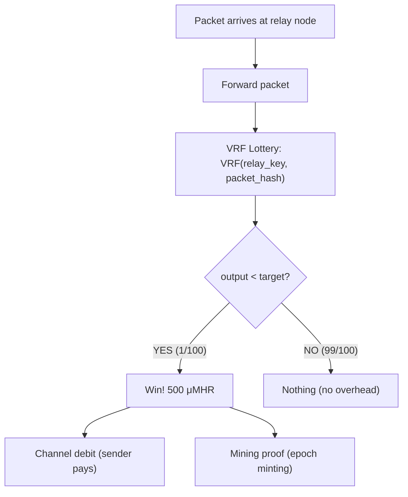
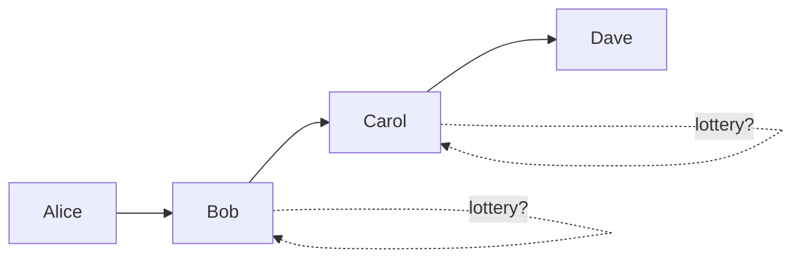

# Stochastic Relay Rewards

Relay nodes are compensated through **probabilistic micropayments** rather than per-packet accounting. This dramatically reduces payment overhead on constrained radio links while providing the same expected income over time.

## Why Not Per-Packet Payment?

Per-packet payment requires a channel state update for every batch of relayed packets. Even batched, this consumes significant bandwidth on LoRa links. The insight: relay rewards don't need to be deterministic — they can be probabilistic, like mining, achieving the same expected value with far less overhead.

## How Stochastic Rewards Work



Each relayed packet is checked against a **VRF-based lottery**. The relay computes a Verifiable Random Function output over the packet, producing a deterministic but unpredictable result that anyone can verify:

```
Relay reward lottery (VRF-based):
  1. Relay computes: (vrf_output, vrf_proof) = VRF_prove(relay_private_key, packet_hash)
  2. Check: vrf_output < difficulty_target
  3. If win: reward = per_packet_cost × (1 / win_probability)
  4. Expected value per packet = reward × probability = per_packet_cost ✓
  5. Verification: VRF_verify(relay_public_key, packet_hash, vrf_output, vrf_proof)
```

**Why VRF, not a random nonce?** If the relay chose its own nonce, it could grind through values until it found a winner for every packet, extracting the maximum reward every time. The VRF produces exactly **one valid output** per (relay key, packet) pair — the relay cannot influence the lottery outcome. The proof lets any party verify the result without the relay's private key.

The VRF used is **ECVRF-ED25519-SHA512-TAI** ([RFC 9381](https://www.rfc-editor.org/rfc/rfc9381)), which reuses the relay's existing Ed25519 keypair. VRF proof size is 80 bytes, included only in winning lottery claims (not in every packet).

### Example

| Parameter | Value |
|-----------|-------|
| Per-packet relay cost | 5 μMHR |
| Win probability | 1/100 |
| Reward per win | 500 μMHR |
| Expected value per packet | 5 μMHR (same) |
| Channel updates needed | 1 per ~100 packets (vs. every batch) |

A relay handling 10 packets/minute triggers a channel update approximately once every 10 minutes — a **10x reduction** in payment overhead compared to per-minute batching.

### Adaptive Difficulty

The win probability adjusts based on traffic volume. Each relay computes its own difficulty locally based on its observed traffic rate — no global synchronization needed:

```
Difficulty adjustment:
  target_updates_per_minute = 0.1  (one channel update per ~10 minutes)
  observed_packets_per_minute = trailing 5-minute moving average

  win_probability = target_updates_per_minute / observed_packets_per_minute
  win_probability = clamp(win_probability, 1/10000, 1/5)  // bounds

  difficulty_target = MAX_VRF_OUTPUT × win_probability

Traffic tiers (approximate):
  High-traffic links (>100 packets/min):   ~1/1000 probability, larger rewards
  Medium-traffic links (10-100 packets/min): ~1/100 probability
  Low-traffic links (<10 packets/min):     ~1/10 probability, smaller rewards

  Reward on win = per_packet_cost × (1 / win_probability)
  Expected value per packet = per_packet_cost (always, regardless of difficulty)
```

Low-traffic links use higher win probability to reduce variance — a relay handling only a few packets per hour will still receive rewards regularly. The difficulty is computed independently by each relay per-link, so different links on the same node may have different difficulties.

## Bilateral Payment Channels

Rewards are settled through bilateral channels between direct neighbors. Unlike Lightning-style multi-hop payment routing, Mehr uses simple per-hop channels:

- Only two parties need to coordinate
- Both parties are direct neighbors (by definition)
- No global coordination needed

### Channel State

```
ChannelState {
    channel_id: [u8; 16],       // truncated Blake3 hash (16 bytes)
    party_a: [u8; 16],          // destination hash (16 bytes)
    party_b: [u8; 16],          // destination hash (16 bytes)
    balance_a: u64,             // party A's current balance (8 bytes)
    balance_b: u64,             // party B's current balance (8 bytes)
    sequence: u64,              // monotonically increasing (8 bytes)
    sig_a: Ed25519Signature,    // party A's signature (64 bytes)
    sig_b: Ed25519Signature,    // party B's signature (64 bytes)
}
// Total: 16 + 16 + 16 + 8 + 8 + 8 + 64 + 64 = 200 bytes
```

### Channel Lifecycle

1. **Open**: Both parties agree on initial balances. Both sign the opening state (`sequence = 0`).
2. **Update**: On each lottery win, the balance shifts by the reward amount and `sequence` increments by 1. Both parties sign the updated state. Channel updates are infrequent — only triggered by wins.
3. **Settle**: Either party can request settlement. The settlement follows a **two-phase signing protocol** with timeout:

   ```
   Settlement atomicity protocol:

     Phase 1: PROPOSE
       Initiator creates SettlementRecord with current balances and sequence.
       Initiator signs it (sig_a or sig_b, depending on who initiates).
       Initiator sends the half-signed record to the counterparty.

     Phase 2: COUNTERSIGN
       Counterparty verifies: balances match local channel state, sequence matches.
       Counterparty signs the record (adding the second signature).
       Counterparty sends the fully-signed record back to the initiator.
       Both parties gossip the fully-signed record to the network.

     Timeout handling:
       settlement_timeout = 120 gossip rounds (~2 hours at 60-second rounds)

       If counterparty does not countersign within settlement_timeout:
         1. The half-signed record is DISCARDED (not published)
         2. The channel remains open with its current state
         3. The initiator may retry settlement
         4. After 3 failed settlement attempts (3 × timeout = ~6 hours):
            The initiator may file a UNILATERAL SETTLEMENT using the
            last mutually-signed ChannelState:
              UnilateralSettlement {
                  channel_id: [u8; 16],
                  last_state: ChannelState,    // must have both signatures
                  reason: enum { CounterpartyUnresponsive, ChannelAbandonment },
                  filed_by: NodeID,
                  signature: Ed25519Signature,
              }
            The unilateral settlement enters a challenge window (2,880 gossip
            rounds / ~48 hours). The counterparty can respond with a
            higher-sequence state to override.

     Partial (one-signature) state:
       A SettlementRecord with only one signature is NEVER published to the
       network. It is strictly a local, ephemeral negotiation artifact.
       The CRDT ledger only accepts records with both valid signatures.
       This is all-or-nothing — there is no partial settlement state.

     Channel close after repeated failure:
       If settlement fails repeatedly (counterparty consistently offline):
         1. After 4 epochs of no updates: standard abandonment rules apply
            (either party unilaterally closes with last mutually-signed state)
         2. The unilateral close enters the 2,880-round challenge window
         3. If unchallenged: the close is finalized and balances are settled
         4. Remaining balance returns to each party per the last signed state
   ```

   Both sign a `SettlementRecord` whose `final_sequence` matches the current channel `sequence`. The record is gossiped to the network and applied to the [CRDT ledger](crdt-ledger). The channel remains open after settlement — subsequent lottery wins continue from the settled point.
4. **Dispute**: If one party submits an old state, the counterparty can submit a higher-sequence state within a **2,880 gossip round challenge window** (~48 hours at 60-second rounds). The higher sequence always wins.
5. **Abandonment**: If a channel has no updates for **4 epochs**, either party can unilaterally close with the last mutually-signed state. This prevents permanent fund lockup.

### Settlement Timing

Lottery wins accumulate as local channel state updates (balance shifts + sequence increments). Settlements to the CRDT ledger are **not** created per-win — they are created when either party decides to finalize:

```
Settlement triggers:
  - Either party requests cooperative settlement
  - Channel dispute (one party publishes an old state)
  - Channel abandonment (4 epochs of inactivity)
  - Periodic finalization (recommended: once per epoch)

Between settlements, interim balances are NOT gossiped.
Only the two parties track the current ChannelState locally.
```

This preserves the stochastic lottery's bandwidth savings: a relay handling 10 packets/minute triggers ~6 local channel updates per hour, but settlements to the CRDT ledger happen much less frequently.

### Sequence Number Semantics

The `sequence` field is a monotonically increasing version number:

- Each update increments `sequence` by 1; both parties must sign the same sequence
- A `SettlementRecord` references `final_sequence` — the sequence of the state being settled
- After settlement, the channel continues with `sequence > final_sequence`
- Dispute resolution: higher `sequence` always wins, regardless of settlement history
- Replay protection: the CRDT ledger rejects settlements where `final_sequence` is not greater than the last settled sequence for the same `channel_id`

## Multi-Hop Payment

When Alice sends a packet through Bob → Carol → Dave, each relay independently runs the VRF lottery:



A lottery win triggers compensation through one or both mechanisms:

1. **Channel debit** (if a channel exists with the upstream sender): Bob's win debits Alice's channel with Bob; Carol's win debits Bob's channel with Carol. A **2% service burn** is applied — the relay receives 98% of the payout, and 2% is permanently destroyed. This is the steady-state mechanism once MHR is circulating.
2. **Mining proof** (demand-backed): The channel debit (post-burn) is recorded as a service proof entitling the relay to a share of the epoch's [minting reward](mhr-token#demand-backed-proof-of-service-mining-mhr-genesis) — but only if the packet traversed a funded payment channel. Free-tier trusted traffic does not earn minting rewards. Relay channel debits contribute to the same minting pool as storage and compute debits (see [All-Service Minting](mhr-token#all-service-minting)). Minting is the dominant income source during bootstrap and provides a baseline subsidy that decays over time.

Most packets trigger no channel update at all. Each hop is independent — no end-to-end payment coordination.

## Demand-Backed Minting Eligibility

A relay channel debit is **minting-eligible** only if the packet that triggered it traversed a funded payment channel with the upstream sender. This is one component of the [anti-gaming defense](mhr-token#proof-self-dealing-is-unprofitable):

```
Minting eligibility rule (relay):

  VRF win on packet P at relay R:
    IF upstream channel(sender, R) is funded (balance > 0):
      → Channel debit counts toward R's epoch minting share
    ELSE (free-tier trusted traffic, or no funded channel):
      → Does NOT count toward minting

  Why:
    Without this rule, a Sybil attacker can fabricate traffic between
    colluding nodes and claim minting rewards for zero-cost "work."

    With this rule, generating minting-eligible traffic requires
    spending real MHR through funded channels.
```

**Free-tier trusted traffic**: Trusted peers relay for free — this is unchanged. Free relay is a benefit of the trust network, not a minting mechanism.

**Channel-funded payments (mechanism 1)**: Unaffected. When a relay wins the lottery and has a funded channel with the sender, the channel debit happens regardless of minting eligibility.

**All-service minting**: Relay channel debits contribute to the same minting pool as storage and compute debits. See [All-Service Minting](mhr-token#all-service-minting) for the unified model.

## Revenue-Capped Minting

Even with demand-backed minting eligibility, an attacker could spend MHR on funded channels to generate minting-eligible traffic. The full anti-gaming defense combines **net-income revenue cap**, **non-deterministic service assignment**, and **service burn + active-set scaling** to ensure self-dealing is never profitable in a connected network and that isolated partition supply growth is bounded by scaled emission per epoch:

```
Revenue-capped minting formula (net-income based, with scaling and burn):

  Service burn: 2% of every funded-channel payment is permanently destroyed.
    Provider receives 98% of each channel payment.

  For each provider P this epoch:
    P_income  = total payments received for services (post-burn, 98%)
    P_spending = total payments sent across all channels
    P_net     = max(0, P_income - P_spending)
      → only funded-channel activity counts

  minting_eligible = Σ P_net for all providers P

  Active-set-scaled emission:
    scaled_emission = emission_schedule(epoch) × min(active_set_size, 100) / 100

  effective_minting(epoch) = min(
      scaled_emission,                       // active-set-scaled halving ceiling
      minting_cap × minting_eligible         // 0.5 × net economic activity
  )

  minting_cap = 0.5

  Why net income (not gross debits):
    Cycling MHR back and forth inflates gross debits but produces
    net income = 0 for every participant. Only one-directional flows
    (real demand) produce positive net income.

  Why active-set scaling:
    A 3-node partition gets 3% of full emission (not 100%).
    The 2% burn provides additional friction (~4% reduction in
    attacker growth rate) and absorbs excess supply after merge.
```

See [Revenue-Capped Minting](mhr-token#revenue-capped-minting) in the MHR Token spec for the complete self-dealing analysis, and the [Security Analysis](mhr-token#security-analysis) for all attack vectors including cycling prevention and isolated partition bounds.

**Impact on supply curve:**

- Early network (low traffic): actual minting is well below the emission schedule. Supply grows slowly, tracking real economic activity.
- Growing network: actual minting approaches emission ceiling as service fees increase.
- Mature network: revenue cap is rarely binding (net service activity far exceeds the emission schedule). Supply follows the standard halving schedule.

## Efficiency on Constrained Links

| Metric | Value |
|--------|-------|
| State update size | 200 bytes |
| Average updates per hour (1/100 prob, 10 pkts/min) | ~6 |
| Bandwidth overhead at 1 kbps LoRa | ~0.3% |
| Compared to per-minute batching | **~8x reduction** |

The stochastic model fits within [Tier 2 (economic)](../protocol/network-protocol#bandwidth-budget) of the gossip bandwidth budget even on the most constrained links.

## Trusted Peers: Free Relay

Nodes relay traffic for [trusted peers](trust-neighborhoods) for free — no lottery, no channel updates. The stochastic reward system only activates for traffic between non-trusted nodes. This mirrors the real world: you help your neighbors for free, but charge strangers for using your infrastructure.
