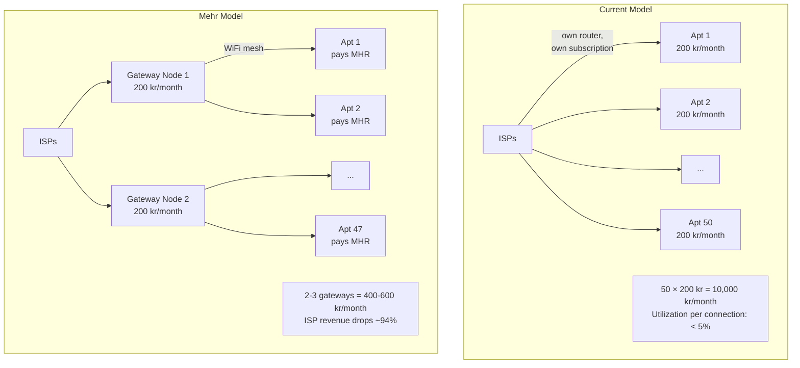

# Real-World Economics

Mehr doesn't exist in a vacuum. It interacts with the existing internet economy — ISPs, cloud providers, and the people who pay for connectivity today. This page examines what happens when a mesh network meets existing infrastructure economics.

## The Apartment Building Scenario

Consider a typical apartment building in Denmark:



### Why This Works

Residential internet connections are massively over-provisioned. A 1 Gbps connection serving one household averages under 50 Mbps actual usage, and most of that is concentrated in evening hours. The infrastructure exists to handle peak load, but sits idle the vast majority of the time.

With Mehr, 2-3 well-placed gateway nodes with good internet connections can serve an entire building. The gateway operators earn MHR from the other residents — effectively becoming micro-ISPs within their building.

### What Happens to ISPs?

**Mehr doesn't kill ISPs. It restructures them.**

| Today | With Mehr |
|-------|-----------|
| ISPs sell per-household subscriptions | ISPs sell per-building or per-community connections |
| Revenue depends on subscriber count | Revenue depends on bandwidth sold |
| Last-mile infrastructure to every apartment | Last-mile to building entry point; mesh handles internal distribution |
| ISPs handle per-customer support | Gateway operators handle local support |
| ISPs own the customer relationship | The community owns its own network |

The key insight: **ISPs already don't want to be last-mile providers.** Last-mile infrastructure (running cable to every apartment) is their most expensive, lowest-margin business. Mehr handles last-mile distribution through the mesh, letting ISPs focus on what they're actually good at — backbone transit and peering.

ISPs would likely respond by:
1. Offering **building connections** — one fat pipe per building at a higher bandwidth tier
2. Pricing by **bandwidth consumed**, not by connection count
3. Becoming **backbone providers** to Mehr gateway operators
4. Running their own **Mehr backbone nodes** to earn routing fees

### The Math for Gateway Operators

```
Gateway operator costs:
  Internet subscription: 200 kr/month
  Hardware (Pi 4 + LoRa + modem): ~300 kr one-time (~25 kr/month amortized over 1 year)
  Total: ~225 kr/month

Gateway operator revenue:
  ~47 apartments paying for shared internet
  If each pays 50 kr/month equivalent in MHR: 2,350 kr/month
  After subtracting costs: ~2,125 kr/month profit

Resident savings:
  Was paying: 200 kr/month
  Now paying: ~50 kr/month in MHR
  Saving: 150 kr/month (75% reduction)
```

Both sides win. Gateway operators earn significant income from hardware they'd have anyway. Residents save money. The only loser is the ISP's per-household billing model — which was always an artifact of last-mile economics, not actual cost.

## How You Earn on Mehr

Every node earns proportionally to the value it provides:

### Relay Earnings

The simplest way to earn. Any node that forwards packets for non-trusted traffic participates in the [stochastic relay lottery](payment-channels). More traffic through your node = more lottery wins = more MHR.

```
Relay earnings estimate (at ~5 μMHR expected reward per packet):
  Minimal relay (ESP32 + LoRa): ~5,000–50,000 μMHR/month
    → ~30-300 packets/day, zero operating cost (solar powered)

  Community bridge (Pi Zero + WiFi): ~50,000–500,000 μMHR/month
    → Bridges LoRa to WiFi, moderate traffic

  Gateway (Pi 4 + cellular): ~500,000–5,000,000 μMHR/month
    → Internet uplink, high-value traffic

  Backbone (mini PC + directional WiFi): 5,000,000+ μMHR/month
    → High-throughput transit between mesh segments
```

### Storage Earnings

Nodes with disk space earn by storing data for the network via [MHR-Store](../services/mhr-store):

- Store popular content that others request frequently
- Host replicated data for availability
- Cache content for faster local access

### Compute Earnings

Nodes with CPUs or GPUs earn by executing contracts and offering inference via [MHR-Compute](../services/mhr-compute):

- Run MHR-Byte contracts for constrained nodes
- Offer WASM execution for heavier workloads
- Provide ML inference (speech-to-text, translation, image generation)

### Gateway Earnings

The highest-value service. Internet gateway operators earn from:

- HTTP proxy services
- DNS relay
- Bridge traffic between mesh and internet
- All of the above, plus relay/storage/compute earnings

### What Makes a Node Valuable?

The marketplace naturally prices capabilities based on scarcity and utility:

| Factor | Effect on Earnings |
|--------|-------------------|
| **Connectivity** | More links = more routing traffic = more relay earnings |
| **Location** | Strategic position (bridge between clusters) = higher routing value |
| **Uptime** | 24/7 availability = more agreements, better reputation |
| **Storage capacity** | More disk = more storage contracts |
| **Compute power** | GPU = high-value inference contracts |
| **Internet access** | Gateway capability = premium pricing |
| **Trust network size** | More trusted peers = higher credit lines, more routing |

## Broader Economic Implications

### For Developing Regions

In areas with no ISP at all, Mehr enables community networks from scratch:

1. One satellite or cellular connection serves an entire village via mesh
2. The gateway operator earns from the community
3. Community members earn by relaying for each other and for outsiders
4. Economic activity within the mesh is free (trusted peers)
5. External connectivity costs are shared, not per-household

### For Urban Areas

In cities where internet is available but expensive:

1. Shared internet connections reduce per-household costs by 50-75%
2. Local services (storage, compute, messaging) run on the mesh with no cloud dependency
3. Community infrastructure becomes an income source, not a cost center

### For Censorship-Resistant Communication

When governments control the internet:

1. The mesh operates independently of ISP infrastructure
2. Even if internet gateways are shut down, local communication continues
3. Gateway nodes with satellite uplinks or VPN tunnels become high-value — and the market prices them accordingly

## The Concentration of Compute

### The Problem

The world's compute infrastructure is concentrating at an unprecedented rate. Hyperscale data centers — owned by a handful of companies — now account for 44% of global data center capacity (Q1 2025, Synergy Research), up from under 30% five years ago. Three cloud providers (AWS, Azure, Google Cloud) control 63% of the cloud infrastructure market. By 2030, hyperscalers are projected to command 61% of all global data center capacity, with on-premise facilities shrinking to just 22%.

AI has accelerated this concentration dramatically. A single AI training run in 2025 requires 15,000–25,000 advanced GPUs at a cost of $120M–$450M. NVIDIA controls 80–92% of the AI accelerator market, with its entire Blackwell chip production run sold out before launch. The supply chain is even more concentrated than the compute itself: three manufacturers (SK Hynix, Samsung, Micron) control 100% of HBM (High Bandwidth Memory) production — the specialized memory required for AI accelerators. SK Hynix alone holds ~60% market share and has sold out its entire 2026 supply. HBM is not available to consumers at all — it is soldered onto GPU packages during manufacturing, never sold as a separate component.

This is industry gatekeeping at the hardware level. The ability to train and run AI models is increasingly restricted to organizations that can secure allocation from a single chip vendor and a three-company memory oligopoly. Microsoft alone announced $80B in AI infrastructure spending for 2025. The gap between those who can access compute and those who cannot is widening faster than at any point in the history of computing.

### Why Crypto Doesn't Fix This

Decentralized networks were supposed to distribute power. In practice, the dominant consensus mechanisms reproduce existing inequality:

**Proof of Work** concentrates around cheap electricity and specialized hardware. Six mining pools mine over 95% of all Bitcoin blocks. The top two pools (Foundry and AntPool) control ~50% of total network hashrate. Individual miners with consumer hardware cannot compete.

**Proof of Stake** concentrates around existing capital. Ethereum whale wallets hold 57% of supply (December 2024). Two staking entities control ~60% of the staking market. PoS has a built-in compounding effect: larger stakers earn proportionally more rewards, making wealth concentration self-reinforcing. The entity-clustered Gini coefficient for Bitcoin is approximately 0.83 — worse than any national economy's wealth distribution.

Decentralized compute projects (Akash, Render, Golem) have attempted to build distributed alternatives to cloud computing. The results are mixed. Akash has ~1,000 GPUs across 65+ data centers, but its growth strategy involves onboarding 7,200 enterprise-grade GPUs operated by vetted "Nodekeepers" — re-centralizing by another name. Render Network's top 100 wallets hold 45% of circulating supply. These projects improve on hyperscaler monopolies, but their economic models still favor large, well-capitalized operators over distributed participants.

The pattern is consistent: **when all compute is valued equally regardless of location, capital concentration wins.** Whoever can deploy the most hardware in the cheapest facility captures the most value.

### Why Mehr Is Structurally Different

Mehr breaks this pattern because **not all compute, storage, and bandwidth are valued equally.** The protocol's economics are designed around a principle that distinguishes it from every other decentralized network: proximity to demand determines value.

#### Relay Economics: Every Hop Earns Independently

In Mehr, every relay node on a multi-hop path runs its own [stochastic reward lottery](payment-channels). A message crossing 8 hops generates 8 independent earning opportunities — one for each relay. This means:

- **Distributed relay networks earn more in aggregate** than a single concentrated hub handling the same traffic
- **A node positioned between two communities** (a bridge node) earns on every packet crossing the boundary — regardless of how powerful it is
- **An ESP32 on a rooftop** earning relay fees on a busy LoRa link can out-earn a rack server in a data center that nobody routes through

The value of a relay node is determined by its position in the network topology, not its hardware specifications.

#### Discovery: Local-First by Design

[Service discovery](../marketplace/discovery) uses concentric rings. Ring 0 (direct neighbors) exchanges full capability information for free every 60 seconds. Ring 1 (2–3 hops) shares summarized capabilities every few minutes. Ring 2+ provides only coarse hints, on demand.

The consequence: **most service requests resolve locally.** A storage request finds a nearby provider before it ever discovers a distant data center. A compute job delegates to a neighbor's GPU before querying the wider network. The further out a query goes, the higher the latency and cost — which naturally incentivizes local provision of common capabilities.

#### Cost-Weighted Routing: Distance Costs Money

Mehr's routing scores each path using a weighted combination of XOR distance, [cumulative cost](../protocol/network-protocol#routing), and latency. Under the default "Cheapest" routing policy (β=0.8 cost weight), cumulative cost dominates path selection. Every hop adds cost. A compute provider 2 hops away will almost always be selected over an equivalent provider 10 hops away — because the 10-hop path costs 5× more in relay fees.

This is the opposite of cloud economics, where a centralized data center amortizes distance through backbone networks. In Mehr, **the network charges for distance.** A GPU in your neighbor's garage is cheaper to use than a GPU farm across the continent, even if the farm has 1000× more hardware.

#### Trust Neighborhoods: Free at the Edge, Paid at the Core

[Trust neighborhoods](trust-neighborhoods) create zero-cost zones. Trusted peers relay for each other for free — no tokens, no channels, no overhead. A village mesh where everyone trusts each other operates with zero economic friction.

This means a small community with distributed hardware (a few Raspberry Pis, some storage, maybe a GPU) operates as a self-sufficient compute cluster at zero cost. The economic layer only activates when requests cross trust boundaries. Concentrated data centers, by definition, exist outside most users' trust neighborhoods — they always incur economic costs that local providers don't.

#### Anti-Concentration Mechanisms

Three protocol-level mechanisms prevent capital from capturing the network:

1. **Non-deterministic service assignment**: Clients cannot choose which node serves their request. [DHT ring assignment](../services/mhr-dht) uses `hash(content_id || epoch_hash)` — the epoch hash is unpredictable, preventing a large operator from grinding assignments toward their own nodes.

2. **Net-income revenue cap**: [Minting eligibility](mhr-token#revenue-capped-minting) is based on net income (income minus spending), not gross revenue. An operator cycling MHR between their own nodes generates net income of zero — no minting. Self-dealing is structurally unprofitable in any connected network.

3. **Active-set scaled emission**: A 3-node partition (or a 3-node cluster operated by one entity) receives only 3% of full emission. You cannot earn more by concentrating — you earn proportionally to the network's active set size.

Together, these mechanisms ensure that **a single entity operating 1,000 nodes in a data center earns less per node than 1,000 independent operators each running one node in different locations.** The concentrated operator faces zero net income from internal transfers, while the distributed operators each earn genuine net income from serving distinct local demand.

### What This Means in Practice

| Scenario | Cloud / Traditional Crypto | Mehr |
|----------|--------------------------|------|
| **Who earns from relay?** | Backbone operators with the most bandwidth | Every relay node on every path, proportional to traffic |
| **Who earns from storage?** | Whoever operates the most disks | Nodes closest to where data is requested (DHT + cost weighting) |
| **Who earns from compute?** | Whoever deploys the most GPUs | Nodes nearest to the requester (discovery rings + routing cost) |
| **Can a whale dominate?** | Yes — more capital → more mining/staking → more revenue | No — net-income cap makes self-dealing unprofitable; non-deterministic assignment prevents selection |
| **Does hardware concentration help?** | Yes — economies of scale in data centers | Limited — proximity advantage outweighs scale advantage for most workloads |
| **Does geographic distribution help?** | No — it increases latency and management cost | Yes — distributed nodes are closer to more users, earning more from proximity |

### Honest Limitations

Mehr does not solve the concentration of compute. It restructures incentives so that distributed participation is valued, but it does not conjure GPUs out of thin air:

- **AI training** requires massive parallel compute that a distributed mesh cannot provide. Training a frontier model needs 15,000+ GPUs with fast interconnects. Mehr serves inference and edge workloads, not training.
- **HBM scarcity** is a physical supply chain problem. Mehr can't create memory that doesn't exist. What it can do is make efficient use of the consumer hardware that does exist — especially for inference, where a single GPU with consumer VRAM can serve many requests.
- **Economies of scale still exist** for raw hardware procurement. A data center buying 10,000 GPUs gets better per-unit pricing than an individual buying one. Mehr's advantage is in the *operational* economics — proximity reduces relay costs, trust reduces overhead, and the revenue cap prevents monopoly pricing.
- **Not all workloads benefit equally.** Latency-sensitive edge workloads (inference, real-time processing, content delivery) benefit most from proximity-based pricing. Batch processing workloads with no latency requirements may still be cheaper in centralized facilities.

The claim is not that Mehr eliminates inequality. The claim is that Mehr's economic structure — uniquely among decentralized networks — **values where you are, not how much you have.** A solar-powered relay on a rooftop in Lagos serving its neighborhood earns based on the traffic it carries, not the capital behind it. That is a structural difference from every proof-of-work, proof-of-stake, and existing decentralized compute market.
