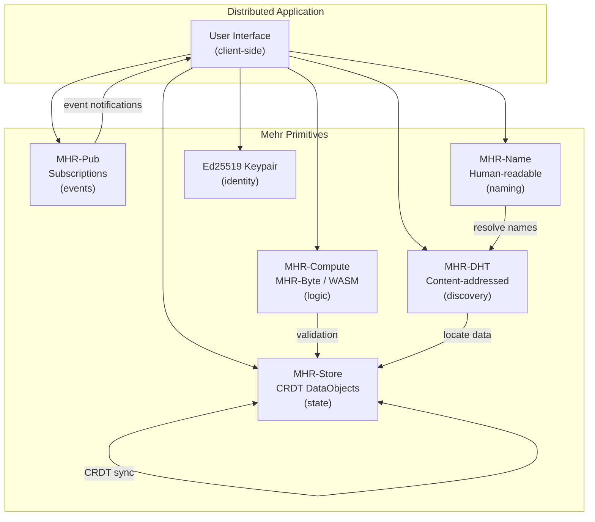

# Distributed Applications

Mehr provides low-level primitives — storage, compute, pub/sub, DHT, naming, identity. This page describes how those primitives compose into distributed applications without a central server, blockchain, or global consensus.

## Application Model

An application on Mehr is a composition of five elements:

```
Application = State + Logic + Events + Identity + Discovery

  State:     CRDT DataObjects in MHR-Store (replicated, eventually consistent)
  Logic:     MHR-Byte / WASM in MHR-Compute (deterministic, verifiable)
             Opaque compute for heavy workloads (GPU/NPU, reputation-verified)
  Events:    MHR-Pub subscriptions (reactive updates, scoped)
  Identity:  Ed25519 keypairs (same as node identity)
  Discovery: MHR-DHT (content-addressed) + MHR-Name (human-readable)
```

There is no "app server." Each user's node runs the application logic, stores its own state, and synchronizes with other participants through the mesh.

## How It Works



**State** lives in [MHR-Store](mhr-store) as CRDT DataObjects. CRDTs guarantee eventual consistency without consensus — two nodes that edit the same object offline will converge when they reconnect. No conflict resolution protocol needed.

**Logic** runs in [MHR-Compute](mhr-compute). Deterministic contracts (MHR-Byte or WASM) handle validation, access control, and state transitions. Heavy workloads (ML inference, media processing) use [opaque compute](mhr-compute#opaque-compute-hardware-accelerated-services) — delegated to GPU/NPU nodes and verified by reputation or redundant execution.

**Events** flow through [MHR-Pub](mhr-pub). When state changes, the authoring node publishes a notification. Subscribers receive updates reactively — no polling.

**Identity** is an Ed25519 keypair — the same key used for node identity. No separate "app accounts." A user's identity is portable across applications.

**Discovery** uses [MHR-DHT](mhr-dht) for content-addressed lookups and [MHR-Name](mhr-name) for human-readable resolution.

## Comparison with Other Frameworks

| | Mehr | Freenet | Holochain | Ethereum |
|---|---|---|---|---|
| **State model** | CRDT (eventually consistent) | Contracts (per-key) | Agent-centric (source chains) | Global state (blockchain) |
| **Compute** | Explicit, paid | Implicit in storage | Validation functions | Global EVM |
| **Consensus** | None (CRDT convergence) | None (contract logic) | Per-app validation | Global PoS |
| **Storage** | Paid per-duration | Donated | Agent-hosted | On-chain (expensive) |
| **Hardware** | ESP32 to datacenter | Desktop+ | Desktop+ | Full node required |
| **Offline** | Full partition tolerance | Limited | Offline-first | No |

## Example: Decentralized Forum

A community forum using Mehr primitives:

```
Forum application:

  State (MHR-Store):
    - ForumConfig: CRDT DataObject with forum name, rules, moderator list
    - Thread: one DataObject per thread (append-only CRDT log of post references)
    - Post: one DataObject per post (mutable — author can edit)

  Logic (MHR-Compute):
    - PostValidator contract: checks post format, size limits, rate limits
    - ModerationContract: checks if author is banned, if content matches filter rules
    - Runs on any node (MHR-Byte — works on ESP32)

  Events (MHR-Pub):
    - subscribe(Scope(Topic("forums", "portland-general")), Push)
    - New posts trigger envelope notifications to all subscribers

  Identity:
    - Forum members are Ed25519 keypairs
    - Moderators are listed in ForumConfig (by NodeID)
    - No separate registration — just start posting

  Discovery:
    - Forum name registered via MHR-Name: "portland-general@geo:portland"
    - Threads discoverable via MHR-DHT by content hash
```

**User experience**: Subscribe to the forum topic. Receive post notifications via MHR-Pub. Browse post envelopes (free). Fetch full posts on demand (paid if outside trust network). Post by creating a DataObject and publishing a notification. Moderators update the ForumConfig to ban users — the ModerationContract enforces it at validation time.

## Example: Collaborative Wiki

A wiki where multiple authors edit shared documents:

```
Wiki application:

  State (MHR-Store):
    - WikiPage: CRDT DataObject per page (text CRDT — e.g., RGA or Peritext)
    - PageIndex: CRDT DataObject mapping page titles to content hashes
    - EditHistory: append-only log of edit metadata (author, timestamp, summary)

  Logic (MHR-Compute):
    - MergeContract: CRDT merge rules for concurrent edits
    - AccessControl: checks editor permissions (open wiki vs. invited editors)
    - Runs as WASM on Community-tier+ (text CRDTs need more memory than MHR-Byte)

  Events (MHR-Pub):
    - subscribe(Node(wiki_owner_id), Push) for page update notifications
    - Editors receive real-time notifications of concurrent edits

  Identity:
    - Editors identified by Ed25519 keypair
    - Edit attribution is cryptographic (signed edits)

  Discovery:
    - Wiki registered via MHR-Name: "mehr-wiki@topic:documentation"
    - Pages discoverable by title via PageIndex or by hash via MHR-DHT
```

**Offline editing**: An editor on a partitioned node edits a page locally. The text CRDT records the operations. On reconnection, the CRDT merges automatically — no manual conflict resolution. Two editors changing different paragraphs merge cleanly. Two editors changing the same sentence produce a deterministic merge (last-writer-wins per character, or interleaving, depending on CRDT choice).

## What Mehr Does NOT Provide

- **No global state machine** — no blockchain, no global consensus. Applications that need "everyone agrees on one truth" must use CRDTs (eventual consistency) or application-level coordination.
- **No automatic code execution at storage nodes** — storage is dumb. A storage node stores bytes and serves them on request. It does not execute contracts on stored data. Compute is always explicit and paid.
- **No contract composability** — contracts don't call other contracts. Each contract is an independent unit of execution. Applications compose at the application layer, not the contract layer.
- **No transaction atomicity across nodes** — you cannot atomically update state on two different nodes. CRDTs provide eventual consistency, not transactional guarantees.

These are deliberate: global state and atomic transactions require consensus, which contradicts partition tolerance. Mehr chooses partition tolerance and eventual consistency over global coordination — the right tradeoff for a mesh network where disconnection is normal.
