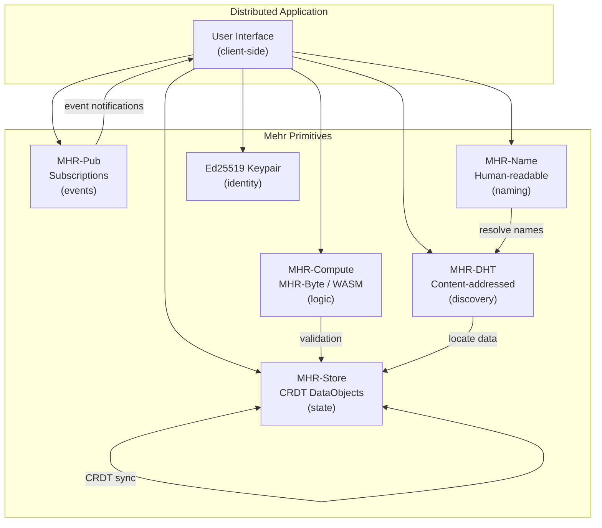

# Distributed Applications

Mehr provides low-level primitives — storage, compute, pub/sub, DHT, naming, identity. This page describes how those primitives compose into distributed applications without a central server, blockchain, or global consensus.

## Application Model

An application on Mehr is a composition of five elements:

```
Application = State + Logic + Events + Identity + Discovery

  State:     CRDT DataObjects in MHR-Store (replicated, eventually consistent)
  Logic:     MHR-Byte / WASM in MHR-Compute (deterministic, verifiable)
             Opaque compute for heavy workloads (GPU/NPU, reputation-verified)
  Events:    MHR-Pub subscriptions (reactive updates, scoped)
  Identity:  Ed25519 keypairs (same as node identity)
  Discovery: MHR-DHT (content-addressed) + MHR-Name (human-readable)
```

There is no "app server." Each user's node runs the application logic, stores its own state, and synchronizes with other participants through the mesh.

## How It Works



**State** lives in [MHR-Store](mhr-store) as CRDT DataObjects. CRDTs guarantee eventual consistency without consensus — two nodes that edit the same object offline will converge when they reconnect. No conflict resolution protocol needed.

**Logic** runs in [MHR-Compute](mhr-compute). Deterministic contracts (MHR-Byte or WASM) handle validation, access control, and state transitions. Heavy workloads (ML inference, media processing) use [opaque compute](mhr-compute#opaque-compute-hardware-accelerated-services) — delegated to GPU/NPU nodes and verified by reputation or redundant execution.

**Events** flow through [MHR-Pub](mhr-pub). When state changes, the authoring node publishes a notification. Subscribers receive updates reactively — no polling.

**Identity** is an Ed25519 keypair — the same key used for node identity. No separate "app accounts." A user's identity is portable across applications.

**Discovery** uses [MHR-DHT](mhr-dht) for content-addressed lookups and [MHR-Name](mhr-name) for human-readable resolution.

## AppManifest

An **AppManifest** binds together an application's components — contract code, UI, state schema, event topics — into a single content-addressed artifact. The manifest is an immutable [DataObject](mhr-store) in MHR-Store, identified by its Blake3 hash. Human-readable access uses [MHR-Name](mhr-name) with the [AppManifest target type](mhr-name#name-targets).

```
AppManifest {
    // ── IDENTITY ──
    manifest_version: u8,               // format version (starts at 1)
    app_version: u16,                   // monotonically increasing application version
    publisher: NodeID,                  // publisher's Ed25519 identity
    created: u64,                       // epoch when this manifest was created

    // ── APP CLASSIFICATION ──
    app_type: u8,                       // 0=Full, 1=Headless, 2=Static
    min_tier: u8,                       // minimum device tier required
    compute_tier: u8,                   // 0=None, 1=MHR-Byte, 2=WASM-Light, 3=WASM-Full

    // ── CODE ──
    contract_count: u8,                 // number of contracts (0-15)
    contracts: [Blake3Hash],            // hashes of MHR-Contract code in MHR-Store
    entry_contract: u8,                 // index of primary contract (0xFF = none)

    // ── UI ──
    ui_root: Option<Blake3Hash>,        // root DataObject of UI bundle

    // ── STATE ──
    state_schema_hash: Option<Blake3Hash>, // hash of CRDT state schema definition

    // ── EVENTS ──
    pub_topic_count: u8,                // number of MHR-Pub topic templates (0-4)
    pub_topics: [PubTopicTemplate],     // scoped event channels

    // ── DEPENDENCIES ──
    dependency_count: u8,               // number of app dependencies (0-8)
    dependencies: [AppDependency],      // other apps/contracts this app requires

    // ── METADATA ──
    name_len: u8,                       // display name length (max 32 bytes)
    name: [u8],                         // UTF-8 display name
    description_hash: Option<Blake3Hash>, // hash of full description DataObject

    // ── SIGNATURE ──
    signature: Ed25519Signature,        // publisher signs all fields above
}

PubTopicTemplate {
    scope_type: u8,                     // 0=Geo (inherit user's geo), 1=Topic
    suffix_len: u8,
    suffix: [u8],                       // UTF-8 topic suffix
}

AppDependency {
    dep_type: u8,                       // 0=Contract, 1=App, 2=StorageObject
    hash: Blake3Hash,                   // hash of the required artifact
}
```

### App Types

| | Full | Headless | Static |
|---|---|---|---|
| **Contracts** | 1+ | 1+ | 0 |
| **UI** | Required | None | Required |
| **State schema** | Optional | Optional | None |
| **Min tier** | Community+ | Minimal+ | Community+ |
| **Example** | Forum, marketplace | Validation bot, escrow agent | Blog, documentation site |

**Full**: Contracts + UI + state. The typical distributed application.

**Headless**: Contracts + state, no UI. Background services, validation bots, protocol extensions. Can run on ESP32 if using MHR-Byte contracts.

**Static**: UI only, no contracts. A website served from the mesh. Equivalent to the [hosting](../applications/hosting) model with a formal manifest.

### Dependencies

Apps can declare dependencies on other artifacts:

```
AppDependency types:
  0x00 = Contract    — requires a specific contract by code hash
  0x01 = App         — requires another app's manifest (shared libraries)
  0x02 = StorageObject — requires specific content in MHR-Store (datasets, models, configs)
```

Dependencies are resolved at install time. If a required contract is already cached locally (shared with another app), it is reused. Missing dependencies are fetched from MHR-Store/DHT.

This enables:
- **Shared contracts**: A "CRDT merge library" contract used by multiple apps
- **Data dependencies**: An ML app that requires a specific model stored in MHR-Store
- **App composition**: A dashboard app that depends on a weather app and a forum app

### Manifest Wire Format

| Field | Size | Description |
|-------|------|-------------|
| `manifest_version` | 1 byte | Format version (currently 1) |
| `app_version` | 2 bytes | Application version (u16 LE) |
| `publisher` | 16 bytes | Publisher's destination hash |
| `created` | 8 bytes | Creation epoch (u64 LE) |
| `app_type` | 1 byte | 0=Full, 1=Headless, 2=Static |
| `min_tier` | 1 byte | 0=Minimal, 1=Community, 2=Gateway, 3=Backbone, 4=Inference |
| `compute_tier` | 1 byte | 0=None, 1=MHR-Byte, 2=WASM-Light, 3=WASM-Full |
| `contract_count` | 1 byte | Number of contracts (0-15) |
| `contracts` | 32 x N bytes | Blake3 hashes of contract code |
| `entry_contract` | 1 byte | Index of primary contract (0xFF=none) |
| `ui_root_flag` | 1 byte | 0=absent, 1=present |
| `ui_root` | 0 or 32 bytes | Blake3 hash of UI bundle root |
| `state_schema_flag` | 1 byte | 0=absent, 1=present |
| `state_schema_hash` | 0 or 32 bytes | Blake3 hash of state schema |
| `pub_topic_count` | 1 byte | Number of topic templates (0-4) |
| `pub_topics` | variable | Per template: scope_type (1) + suffix_len (1) + suffix (variable) |
| `dependency_count` | 1 byte | Number of dependencies (0-8) |
| `dependencies` | 33 x N bytes | Per dependency: dep_type (1) + hash (32) |
| `name_len` | 1 byte | Display name length |
| `name` | variable | UTF-8 display name (max 32 bytes) |
| `description_flag` | 1 byte | 0=absent, 1=present |
| `description_hash` | 0 or 32 bytes | Blake3 hash of description DataObject |
| `signature` | 64 bytes | Ed25519 signature over all preceding fields |

**Size examples:**

| App Type | Contracts | Deps | Total |
|----------|-----------|------|-------|
| Headless (1 contract, ESP32) | 32 | 0 | ~185 bytes |
| Static site (no contracts) | 0 | 0 | ~130 bytes |
| Forum (2 contracts + UI) | 64 | 0 | ~285 bytes |
| Complex app (4 contracts + UI + 2 deps) | 128 | 66 | ~395 bytes |

All fit within the 465-byte packet data limit.

### Manifest Message Types

App manifest messages use context byte `0xF7` (social) with sub-types:

| Sub-Type | Name | Description |
|----------|------|-------------|
| `0x0B` | ManifestPublish | Announce a new or updated app manifest |
| `0x0C` | ManifestLookup | Query for an app manifest by hash |
| `0x0D` | ManifestLookupResponse | Return the requested manifest |

## Publishing an Application

```
Developer workflow:

  1. DEVELOP
     Write contract(s) as MHR-Byte bytecode or WASM.
     Build UI as static assets (HTML/CSS/JS).
     Define CRDT state schema (field names, CRDT types, initial values).

  2. STORE CODE
     For each contract:
       Compute Blake3(code) → contract_hash
       Store as immutable DataObject in MHR-Store
       Form StorageAgreements for replication (k≥3 recommended)

  3. STORE UI (if applicable)
     Store each UI asset as an immutable DataObject.
     Create a UI root DataObject linking to all asset hashes.
     Store with replication.

  4. STORE STATE SCHEMA (if applicable)
     Encode CRDT type definitions.
     Store as immutable DataObject.

  5. CREATE MANIFEST
     Populate AppManifest with all hashes, metadata, and dependencies.
     Sign with publisher's Ed25519 key.
     Store manifest as immutable DataObject in MHR-Store.

  6. REGISTER NAME
     Register MHR-Name binding:
       name: "my-forum"
       scope: Topic("apps", "forums")
       target: AppManifest(manifest_hash)    ← target type 0x03
     The name becomes the human-friendly app identifier.

  7. ANNOUNCE (optional)
     Publish notification via MHR-Pub on Scope(Topic("apps"), Prefix).
     Nodes subscribed to app announcements discover the new app.
```

## Discovering and Installing

```
User workflow:

  1. DISCOVER
     Find an app through one of:
       a. Name lookup: "forum-app@topic:apps/forums"
          → resolves to AppManifest hash (target type 0x03)
       b. Topic subscription: subscribe to Scope(Topic("apps"), Prefix)
          → receive announcements of new apps
       c. Peer recommendation: a trusted peer shares a manifest hash
       d. DHT search: query MHR-DHT for a known manifest hash

  2. FETCH MANIFEST
     Retrieve manifest DataObject by hash from MHR-Store/DHT.
     Verify Blake3(manifest_bytes) == expected_hash.
     Verify Ed25519 signature against publisher's public key.
     Check publisher's trust score via MHR-ID:
       trusted publisher     → proceed
       untrusted publisher   → warn user

  3. CHECK COMPATIBILITY
     Compare min_tier against local device capabilities.
     Compare compute_tier against local execution capability:
       MHR-Byte:    any device
       WASM-Light:  Community+ (Pi Zero 2W+)
       WASM-Full:   Gateway+ (Pi 4/5+)
     If underpowered: offer to delegate contract execution via marketplace.

  4. RESOLVE DEPENDENCIES
     For each AppDependency:
       Check local cache — already have it?
       If not: fetch from MHR-Store/DHT by hash.
       Verify content hash on download.
     Dependencies shared across apps are downloaded once.

  5. FETCH COMPONENTS
     Download contract code DataObjects (by hash from contracts[]).
     Download UI root → parse for asset hashes → download assets.
     Download state schema.
     All downloads are content-hash verified.

  6. INITIALIZE STATE
     If state_schema_hash present:
       Parse schema → create local CRDT DataObjects.
       Initialize with default values.
     If joining an existing community (e.g., a forum):
       Discover existing state via DHT/Pub → CRDT merge with peers.

  7. SUBSCRIBE TO EVENTS
     For each PubTopicTemplate:
       Resolve scope_type with user's own scope:
         scope_type=Geo  → use user's Geo scope + suffix
         scope_type=Topic → use suffix directly
       Subscribe via MHR-Pub.
     Subscribe to manifest update channel: Key(manifest_hash).

  8. DONE
     App is "installed" — a purely local operation.
     No server was contacted. No account was created.
```

## Upgrading Applications

AppManifests are **immutable** — each version is a new DataObject with a new hash. Upgrades work by publishing a new manifest and rebinding the MHR-Name.

### Upgrade Flow

```
  1. Publisher creates new manifest:
     app_version incremented
     Updated contract/UI/schema hashes as needed
     Same publisher identity (continuity of authorship)

  2. Publisher rebinds MHR-Name:
     "forum-app@topic:apps/forums" → AppManifest(new_manifest_hash)
     NameBinding sequence number incremented

  3. Publisher notifies via MHR-Pub:
     Topic = Key(old_manifest_hash)
     Payload = new_manifest_hash + app_version
     All installed nodes receive the notification

  4. User-side upgrade:
     Fetch new manifest, verify signature (same publisher)
     Verify app_version > current version
     Download only changed components (unchanged hashes → already cached)
     Apply state migration if schema changed
```

### State Migration

Three strategies depending on whether the state schema changed:

**Compatible** (schema unchanged): State carries over directly. New contract code works with existing CRDT DataObjects. No migration needed.

**Additive** (new fields added, none removed): New schema lists the old schema hash in a `compatible_with` field. New code initializes new fields with defaults. Old state merges cleanly via CRDT semantics.

**Breaking** (incompatible change): New schema includes a `migration_contract` — a contract that transforms old state into new state. The node runs it locally. If migration fails, the user is warned and the old version remains usable.

```
StateSchema {
    fields: [FieldDef],                     // field names, CRDT types, defaults
    compatible_with: [Blake3Hash],          // previous schema hashes (additive compat)
    migration_contract: Option<Blake3Hash>, // contract for breaking migrations
}

FieldDef {
    name: String,                           // field name (max 32 bytes UTF-8)
    crdt_type: CRDTType,                    // GCounter, GSet, LWWRegister, ORSet, RGA, etc.
    default_value: Vec<u8>,                 // CBOR-encoded default for new fields
    required: bool,                         // false = optional field (can be absent)
}
```

### Schema Compatibility Rules

Compatibility between schema versions is **programmatically verifiable**, not purely declared by the developer. A new schema is **additive-compatible** with an old schema if and only if all of the following hold:

```
Additive compatibility rules (checked by runtime):

  1. NO REMOVED FIELDS: Every field in the old schema exists in the new schema
     with the same name and same CRDT type.

  2. NO TYPE CHANGES: A field's CRDT type CANNOT change between versions.
     Rationale: CRDT merge semantics are type-dependent. A GCounter merged
     with an LWWRegister produces undefined behavior.
     If a field must change type → breaking migration required.

  3. NEW FIELDS ONLY: The new schema may add fields not present in the old schema.
     New fields MUST have default_value specified.

  4. REQUIRED → OPTIONAL allowed: A required field can become optional.
     OPTIONAL → REQUIRED forbidden (would break old state missing the field).

Compatibility checker (runs locally at install/upgrade time):
  fn is_compatible(old_schema: &StateSchema, new_schema: &StateSchema) -> bool {
      for old_field in &old_schema.fields {
          match new_schema.fields.find(|f| f.name == old_field.name) {
              None => return false,                    // field removed
              Some(new_field) => {
                  if new_field.crdt_type != old_field.crdt_type {
                      return false;                    // type changed
                  }
                  if new_field.required && !old_field.required {
                      return false;                    // optional → required
                  }
              }
          }
      }
      true
  }
```

The `compatible_with` field in StateSchema lists schema hashes that pass this check. At install time, the runtime verifies the declaration by running the compatibility checker. A manifest that declares `compatible_with` for an incompatible schema is rejected.

### Old Code Encountering New Schema State

When a node running old code encounters new-schema state via CRDT merge:

```
Forward-compatibility behavior:

  Old node receives state with unknown fields:
    1. Unknown fields are preserved as opaque bytes during CRDT merge
    2. Old code ignores unknown fields for application logic
    3. Unknown fields are forwarded in gossip (pass-through)
    4. When the node upgrades, previously-merged unknown fields
       become usable with the new schema

  This works because CRDT merges are per-field:
    - Known fields: merge normally using the field's CRDT type
    - Unknown fields: merge using a generic LWWRegister fallback
      (last-writer-wins by timestamp — safe for pass-through)

  If the unknown field uses a CRDT type the old node doesn't
  understand (e.g., a new CRDT type added in a later protocol version):
    - The field is stored as opaque bytes
    - Merge uses byte-level LWW fallback
    - On upgrade, the node re-merges using the correct CRDT type
    - Temporary merge inaccuracy during the transition is self-correcting
```

### Migration Contract Execution Semantics

When a breaking schema change requires a `migration_contract`, the execution follows a strict protocol:

```
Migration contract execution:

  Input delivery:
    The migration contract receives the FULL old state as a single CBOR-encoded
    input via the LOAD opcode (key = "migration_input").
    Rationale: incremental migration adds complexity without benefit —
    state sizes are bounded by device tier (ESP32: 32 KB, Pi: 1 MB,
    Gateway: 256 MB), so full-state delivery is practical.

  Contract interface:
    // Entry point
    fn migrate(old_state: CBOR) -> Result<CBOR, MigrationError>

    // The contract:
    //   1. Reads old state from LOAD("migration_input")
    //   2. Transforms fields according to the new schema
    //   3. Writes new state to STORE("migration_output")
    //   4. Returns HALT (success) or ABORT (failure)

  Success criteria:
    1. Contract terminates with HALT (not ABORT)
    2. Output at STORE("migration_output") is valid CBOR
    3. Output conforms to the new StateSchema (all required fields present,
       correct CRDT types)
    4. Migration completes within max_cycles (from contract declaration)

  Failure modes:
    - Runtime exception (ABORT opcode): migration_failed, old state preserved
    - Wrong output shape (schema validation fails): migration_failed
    - Timeout (max_cycles exceeded): migration_failed, old state preserved
    - All failures are recoverable — old app version remains functional

  Determinism guarantee:
    Migration contracts MUST be deterministic (same as all MHR-Byte/WASM).
    Two nodes migrating the same state produce identical outputs.
    If nondeterminism is detected (different nodes get different outputs
    for the same input — detected via hash comparison during CRDT sync):
      - The output with the LOWER Blake3 hash wins (arbitrary but deterministic)
      - This should never happen if the contract is correctly written
      - Detection triggers a warning to the app publisher

  Rollback:
    No automatic rollback. If migration succeeds but causes application bugs:
      1. User can pin to old manifest hash (old state still accessible by hash)
      2. Publisher can release a new version with a fix
      3. Old DataObjects remain in MHR-Store indefinitely

  Partial migration:
    NOT supported. Migration is all-or-nothing per state object.
    Rationale: partial migration creates inconsistent state that violates
    schema invariants. If some fields can migrate independently, they
    should be separate DataObjects in the schema design.
```

### Partition Behavior

A partitioned node that missed an upgrade continues running the old version. On reconnection:
1. CRDT state merges normally if schema is compatible
2. If schema is breaking: node detects version mismatch during CRDT sync
3. Node fetches new manifest via MHR-Name re-resolution
4. Runs migration locally, then state converges

### Rollback

There is no protocol-level rollback mechanism. If a new version is broken:
- Users can pin to an old manifest hash (local override)
- The publisher can publish a newer version that reverts changes
- Old manifests, contracts, and state remain available by content hash

## App Naming

Apps use the [AppManifest target type](mhr-name#name-targets) (0x04) in MHR-Name. This lets the naming layer distinguish apps from regular content, enabling app-specific discovery and UI treatment.

**Naming convention**: Apps register under `topic:apps/*` scopes:

```
forum-app@topic:apps/forums
wiki-app@topic:apps/collaboration
weather-bot@topic:apps/utilities
portland-transit@geo:portland           ← geo-scoped app
```

**App lifecycle maps to name lifecycle**:

| App Action | Name Operation |
|-----------|---------------|
| Publish app | Register name → AppManifest(hash) |
| New version | Update name (sequence+1) → AppManifest(new_hash) |
| Unpublish | Revoke name |
| Browse apps | Query `Scope(Topic("apps"), Prefix)` filtered by target type 0x03 |

**Trust-weighted discovery** applies naturally — apps from trusted publishers rank higher in resolution. An untrusted publisher's app scores at the 0.01 floor, making it nearly invisible unless the user explicitly searches for it by hash.

**App browsing**: Subscribe to `Scope(Topic("apps"), Prefix)` via MHR-Pub to receive announcements of new and updated apps within your scope. This is Mehr's equivalent of an app store — decentralized, trust-weighted, with no central curation.

## Design Decision: No Delegate Concept

[Freenet](https://freenet.org) uses a three-component model: **contracts** (public replicated state), **delegates** (private local agents holding secrets), and **UIs** (web frontends). The delegate acts as a local policy enforcer — it holds private keys, manages per-app secrets, and communicates via actor-model message passing.

Mehr does not need a separate delegate concept. The same functionality is covered by existing primitives:

| Freenet Delegate Feature | Mehr Equivalent |
|--------------------------|-----------------|
| Hold private keys | Node's Ed25519 identity + local keystore |
| Per-app secret state | Local node storage (never replicated) |
| Policy enforcement | MHR-Compute contracts running locally |
| Message passing | MHR-Pub subscriptions + direct messages |
| Authorized actions | Contract logic checks `SENDER` opcode |

A Mehr app that needs private state stores it locally on the node — it never enters MHR-Store, is never gossiped, and is never visible to other nodes. Contracts running locally via MHR-Compute have no I/O or network access, providing the same sandboxing guarantees as Freenet delegates. Adding a formal delegate concept would introduce a new abstraction layer with minimal benefit over the existing primitives.

## Security Considerations

### Publisher Authentication

Every AppManifest is signed by the publisher's Ed25519 key. The publisher's identity is verifiable via [MHR-ID](mhr-id) claims and vouches. A manifest from an unknown or untrusted publisher triggers a trust warning at install time. Trust scoring follows the same model as [MHR-Name resolution](mhr-name#resolution-priority).

### Content Integrity

Every component is content-addressed by Blake3 hash — contract code, UI assets, state schema, and the manifest itself. A malicious storage node cannot tamper with any component without changing its hash, which breaks the manifest reference. Verification is automatic and requires no trust in storage providers.

### Malicious Code

MHR-Byte and WASM contracts are fully sandboxed — no I/O, no network, no filesystem access. Malicious contract code cannot escape the compute sandbox. UI code (HTML/JS) is **not sandboxed** by the protocol — it runs in the user's local rendering environment. Mitigations: content-hash verification ensures UI hasn't been tampered with, and trusted publisher vouches via MHR-ID provide social proof of safety.

### Supply Chain Attacks

A compromised publisher key could push a malicious update. Mitigations:
- Old versions remain available by content hash (immutable)
- Key rotation via [MHR-ID](mhr-id#key-rotation) revokes the compromised key
- Users can pin to a specific manifest hash (version pinning)
- Publisher key change triggers a warning (like SSH host key warnings)

### Dependency Integrity

Dependencies are resolved by content hash — a dependency on `Blake3(0x1a2b...)` always resolves to the exact same bytes regardless of where it's fetched from. An attacker cannot substitute a malicious dependency without changing the hash, which would break the manifest's dependency list.

### State Poisoning

A malicious node could inject corrupted CRDT state during sync. Mitigations: contracts validate state transitions (invalid state is rejected), CRDT merge semantics are deterministic (invalid state that passes validation merges consistently), and state mutations are signed by the authoring node.

## Comparison with Other Frameworks

| | Mehr | Freenet | Holochain | Ethereum |
|---|---|---|---|---|
| **State model** | CRDT (eventually consistent) | Contracts (per-key replicated) | Agent-centric (source chains) | Global state (blockchain) |
| **Compute** | Explicit, paid, no global state | Implicit in storage ops | Validation functions | Global EVM |
| **Consensus** | None (CRDT convergence) | None (contract logic) | Per-app validation | Global PoS |
| **Storage** | Paid per-duration | Donated | Agent-hosted | On-chain (expensive) |
| **Hardware** | ESP32 to datacenter | Desktop+ | Desktop+ | Full node required |
| **Offline** | Full partition tolerance | Limited | Offline-first | No |
| **App packaging** | AppManifest (content-addressed) | Contract + State (content-addressed) | DNA + UI bundle (hApp) | No standard (dApps are websites) |
| **App discovery** | MHR-Name + trust-weighted | Key-based (must know contract key) | App store / out-of-band | Out-of-band (URLs) |
| **Private local agent** | Node identity + local storage | Delegate (actor model) | Agent (source chain) | Wallet (external) |
| **UI distribution** | DataObjects in MHR-Store | Contract state (WASM-rendered) | Bundled in hApp | Traditional web hosting |
| **Upgrade model** | New manifest + name rebind | New contract key (no migration) | DNA versioning | Contract is immutable |
| **Dependencies** | Content-addressed by hash | Not formalized | Zome composition | Contract composability |

## Example: Decentralized Forum

A community forum using Mehr primitives:

```
Forum application:

  State (MHR-Store):
    - ForumConfig: CRDT DataObject with forum name, rules, moderator list
    - Thread: one DataObject per thread (append-only CRDT log of post references)
    - Post: one DataObject per post (mutable — author can edit)

  Logic (MHR-Compute):
    - PostValidator contract: checks post format, size limits, rate limits
    - ModerationContract: checks if author is banned, if content matches filter rules
    - Runs on any node (MHR-Byte — works on ESP32)

  Events (MHR-Pub):
    - subscribe(Scope(Topic("forums", "portland-general")), Push)
    - New posts trigger envelope notifications to all subscribers

  Identity:
    - Forum members are Ed25519 keypairs
    - Moderators are listed in ForumConfig (by NodeID)
    - No separate registration — just start posting

  Discovery:
    - Forum name registered via MHR-Name: "portland-general@geo:portland"
    - Threads discoverable via MHR-DHT by content hash
```

**User experience**: Subscribe to the forum topic. Receive post notifications via MHR-Pub. Browse post envelopes (free). Fetch full posts on demand (paid if outside trust network). Post by creating a DataObject and publishing a notification. Moderators update the ForumConfig to ban users — the ModerationContract enforces it at validation time.

### Forum AppManifest

```
AppManifest {
    manifest_version: 1,
    app_version: 1,
    publisher: 0x3a7f...b2c1,                // forum developer
    created: 1042,                             // epoch 1042

    app_type: 0,                               // Full (contracts + UI)
    min_tier: 1,                               // Community (needs UI rendering)
    compute_tier: 1,                           // MHR-Byte (runs on ESP32)

    contract_count: 2,
    contracts: [
        Blake3("PostValidator bytecode"),
        Blake3("ModerationContract bytecode"),
    ],
    entry_contract: 0,                         // PostValidator is entry point

    ui_root: Some(Blake3("forum UI root")),

    state_schema_hash: Some(Blake3("forum state schema")),

    pub_topic_count: 1,
    pub_topics: [
        { scope_type: 0, suffix: "forums" },   // Geo — inherits user's geo scope
    ],

    dependency_count: 0,
    dependencies: [],

    name: "Mehr Forum",
    description_hash: Some(Blake3("README")),

    signature: Ed25519Sig(...),
}

Published as: "forum-app@topic:apps/forums" → AppManifest(manifest_hash)
```

**Upgrade to v2 (adds search)**:
1. Publisher adds a SearchIndex contract (contract_count: 3)
2. State schema adds `search_index` CRDT field (compatible_with includes v1 schema hash)
3. New manifest: app_version=2, new hashes
4. Rebind MHR-Name, notify via MHR-Pub
5. Users: fetch new manifest, download SearchIndex, init search_index field
6. Old state merges cleanly — additive migration

## Example: Collaborative Wiki

A wiki where multiple authors edit shared documents:

```
Wiki application:

  State (MHR-Store):
    - WikiPage: CRDT DataObject per page (text CRDT — e.g., RGA or Peritext)
    - PageIndex: CRDT DataObject mapping page titles to content hashes
    - EditHistory: append-only log of edit metadata (author, timestamp, summary)

  Logic (MHR-Compute):
    - MergeContract: CRDT merge rules for concurrent edits
    - AccessControl: checks editor permissions (open wiki vs. invited editors)
    - Runs as WASM on Community-tier+ (text CRDTs need more memory than MHR-Byte)

  Events (MHR-Pub):
    - subscribe(Node(wiki_owner_id), Push) for page update notifications
    - Editors receive real-time notifications of concurrent edits

  Identity:
    - Editors identified by Ed25519 keypair
    - Edit attribution is cryptographic (signed edits)

  Discovery:
    - Wiki registered via MHR-Name: "mehr-wiki@topic:documentation"
    - Pages discoverable by title via PageIndex or by hash via MHR-DHT
```

**Offline editing**: An editor on a partitioned node edits a page locally. The text CRDT records the operations. On reconnection, the CRDT merges automatically — no manual conflict resolution. Two editors changing different paragraphs merge cleanly. Two editors changing the same sentence produce a deterministic merge (last-writer-wins per character, or interleaving, depending on CRDT choice).

### Wiki AppManifest

```
AppManifest {
    manifest_version: 1,
    app_version: 1,
    publisher: 0x8e2d...f4a9,
    created: 1050,

    app_type: 0,                               // Full
    min_tier: 1,                               // Community (WASM + UI)
    compute_tier: 2,                           // WASM-Light

    contract_count: 2,
    contracts: [
        Blake3("MergeContract bytecode"),
        Blake3("AccessControl bytecode"),
    ],
    entry_contract: 0,

    ui_root: Some(Blake3("wiki UI root")),
    state_schema_hash: Some(Blake3("wiki state schema")),

    pub_topic_count: 1,
    pub_topics: [
        { scope_type: 1, suffix: "documentation" },  // Topic scope
    ],

    dependency_count: 0,
    dependencies: [],

    name: "Mehr Wiki",
    description_hash: Some(Blake3("Wiki README")),

    signature: Ed25519Sig(...),
}

Published as: "wiki-app@topic:apps/collaboration" → AppManifest(manifest_hash)
```

## What Mehr Does NOT Provide

- **No global state machine** — no blockchain, no global consensus. Applications that need "everyone agrees on one truth" must use CRDTs (eventual consistency) or application-level coordination.
- **No automatic code execution at storage nodes** — storage is dumb. A storage node stores bytes and serves them on request. It does not execute contracts on stored data. Compute is always explicit and paid.
- **No contract composability** — contracts don't call other contracts. Each contract is an independent unit of execution. Applications compose at the application layer, not the contract layer. Apps can share contracts via dependencies, but contracts cannot invoke each other at runtime.
- **No transaction atomicity across nodes** — you cannot atomically update state on two different nodes. CRDTs provide eventual consistency, not transactional guarantees.
- **No curated app store** — app discovery is decentralized and trust-weighted. There is no central authority that reviews, approves, or ranks applications. Community curation happens organically through vouches and trust relationships.

These are deliberate: global state and atomic transactions require consensus, which contradicts partition tolerance. Mehr chooses partition tolerance and eventual consistency over global coordination — the right tradeoff for a mesh network where disconnection is normal.
