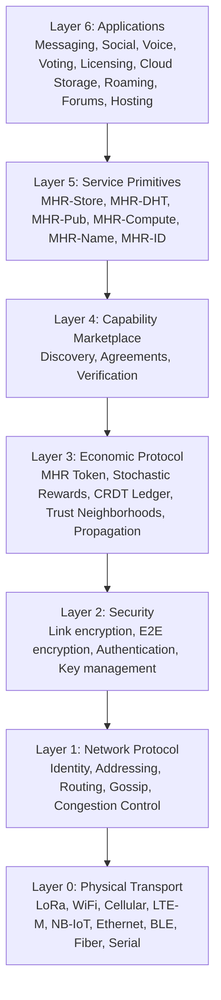

import DownloadButton from '@site/src/components/DownloadButton';

<DownloadButton />

# Mehr Protocol Specification v1.0

This page is the normative reference for the Mehr protocol. Individual documentation pages provide detailed explanations; this page summarizes the protocol constants, wire formats, and layer dependencies in one place.

## Status

| | |
|---|---|
| **Version** | 1.0 |
| **Status** | Design complete, pre-implementation |
| **Normative sections** | Layers 0–5 (transport through services) |
| **Informative sections** | Layer 6 (applications), hardware reference, roadmap |

## Protocol Constants

| Constant | Value | Defined In |
|----------|-------|-----------|
| Gossip interval | 60 seconds | [Network Protocol](protocol/network-protocol#gossip-protocol) |
| Protocol overhead budget | ≤10% of link bandwidth | [Bandwidth Budget](protocol/network-protocol#bandwidth-budget) |
| CompactPathCost size | 6 bytes (constant) | [Network Protocol](protocol/network-protocol#mehr-extension-compact-path-cost) |
| MehrExtension magic byte | `0x4E` ('N') | [Network Protocol](protocol/network-protocol#mehr-extension-compact-path-cost) |
| Destination hash size | 16 bytes (128-bit) | [Network Protocol](protocol/network-protocol#identity-and-addressing) |
| Smallest MHR unit | 1 μMHR | [MHR Token](economics/mhr-token#properties) |
| Supply ceiling | 2^64 μMHR (asymptotic) | [MHR Token](economics/mhr-token#supply-model) |
| Default relay lottery probability | 1/100 | [Stochastic Rewards](economics/payment-channels#example) |
| Payment channel state size | 200 bytes | [Payment Channels](economics/payment-channels#channel-state) |
| Dispute challenge window | 2,880 gossip rounds (~48h) | [Payment Channels](economics/payment-channels#channel-lifecycle) |
| Channel abandonment threshold | 4 epochs | [Payment Channels](economics/payment-channels#channel-lifecycle) |
| Epoch trigger: settlement count | ≥10,000 batches | [CRDT Ledger](economics/crdt-ledger#epoch-triggers) |
| Epoch trigger: GSet memory | ≥500 KB | [CRDT Ledger](economics/crdt-ledger#epoch-triggers) |
| Epoch acknowledgment threshold | 67% of active set | [CRDT Ledger](economics/crdt-ledger#epoch-lifecycle) |
| Epoch verification window | 4 epochs after activation | [CRDT Ledger](economics/crdt-ledger#epoch-lifecycle) |
| Bloom filter FPR (epoch) | 0.01% | [CRDT Ledger](economics/crdt-ledger#bloom-filter-sizing) |
| DHT replication factor | k=3 | [MHR-DHT](services/mhr-dht#replication-factor) |
| DHT XOR weight (w_xor) | 0.7 | [MHR-DHT](services/mhr-dht#lookup-scoring-function) |
| Storage chunk size | 4 KB | [MHR-Store](services/mhr-store#chunking) |
| Presence beacon size | 20 bytes | [Discovery](marketplace/discovery#presence-beacons) |
| Presence beacon interval | 10 seconds | [Discovery](marketplace/discovery#presence-beacons) |
| Transitive credit limit | 10% per hop, max 2 hops | [Trust & Neighborhoods](economics/trust-neighborhoods#trust-based-credit) |
| Max scopes per node | 8 | [Trust & Neighborhoods](economics/trust-neighborhoods#hierarchical-scopes) |
| Max scope depth | 8 segments | [Trust & Neighborhoods](economics/trust-neighborhoods#wire-format) |
| Max scope segment length | 32 characters | [Trust & Neighborhoods](economics/trust-neighborhoods#wire-format) |
| Vouch expiry (default) | 30 epochs | [MHR-ID](services/mhr-id#vouch-properties) |
| Kickback rate range | 0–255 (u8) | [MHR-Store](services/mhr-store#kickback-rate) |
| Default kickback rate | 128 (~50%) | [Content Propagation](economics/propagation#protocol-constants) |
| IdentityClaim min size | 124 bytes | [MHR-ID](services/mhr-id#wire-format) |
| Vouch size | 121 bytes | [MHR-ID](services/mhr-id#vouch-wire-format) |
| Geo verification: min vouches | 3 (for Verified level) | [Voting](applications/voting#geoverificationlevel) |
| Protocol version encoding | 1 byte (major 4 bits, minor 4 bits) | [Versioning](development/versioning#version-field) |
| Extended version escape | Major = 15 → read u16 pair from TLV | [Versioning](development/versioning#version-field) |
| Current protocol version | `0x10` (v1.0) | [Versioning](development/versioning#version-field) |
| Emission halving shift clamp | max 63 (prevents UB at epoch 6.4M+) | [MHR Token](economics/mhr-token#supply-model) |
| Max curated feed entries | 256 per page | [Social](applications/social#5-curated-feed) |
| LicenseOffer min size | ~160 bytes | [Digital Licensing](applications/licensing#wire-format) |
| LicenseGrant size | 226 bytes | [Digital Licensing](applications/licensing#wire-format) |
| Max custom license terms | 1024 characters | [Digital Licensing](applications/licensing#licenseoffer) |

## Cryptographic Primitives

| Purpose | Algorithm | Output / Key Size |
|---------|-----------|-------------------|
| Identity / Signing | Ed25519 | 256-bit (32-byte public key) |
| Key Exchange | X25519 (Curve25519 DH) | 256-bit |
| Identity Hashing | Blake2b | 256-bit → 128-bit truncated |
| Content Hashing | Blake3 | 256-bit |
| Symmetric Encryption | ChaCha20-Poly1305 | 256-bit key, 96-bit nonce |
| Relay Lottery (VRF) | ECVRF-ED25519-SHA512-TAI (RFC 9381) | 80-byte proof |
| Erasure Coding | Reed-Solomon | Configurable k,m |

## Layer Dependency Graph



Each layer depends **only** on the layer directly below it. Applications never touch transport details. Payment never touches routing internals.

## Serialization Rules

All Mehr wire formats use the following conventions:

| Rule | Value |
|------|-------|
| **Byte order** | Little-endian for all multi-byte integers (u16, u32, u64, i64) |
| **Encoding** | Fixed-size binary fields; no self-describing framing (not CBOR, not JSON) |
| **TLV extensions** | Type (u8), Length (u8, max 255), Data (variable). Used in MehrExtension only |
| **Strings** | UTF-8, length-prefixed with u16 (community labels, function IDs) |
| **Hashes** | Raw bytes, no hex encoding on the wire |
| **Signatures** | Raw 64-byte Ed25519 signatures, no ASN.1/DER wrapping |
| **Normalized scores** | Computed on **decoded** values, then divided by the max decoded value in the candidate set. Result is IEEE 754 f32 on nodes that support FP; 16-bit fixed-point (Q0.16, value × 65535) on constrained nodes. Both yield equivalent routing decisions within rounding tolerance |

## Wire Format Summary

### Packet Format (Reticulum-derived)

```
[HEADER 2B] [DEST_HASH 16B] [CONTEXT 1B] [DATA 0-465B]
Max packet size: 484 bytes
Source address: NOT PRESENT (structural sender anonymity)
```

### Mehr Announce Extension

```
[MAGIC 1B: 0x4E] [VERSION 1B] [CompactPathCost 6B] [TLV extensions...]
Minimum: 8 bytes. Carried in announce DATA field.
```

### CompactPathCost

```
[cumulative_cost 2B] [worst_latency_ms 2B] [bottleneck_bps 1B] [hop_count 1B]
Total: 6 bytes (constant regardless of path length)
```

### Payment Channel State

```
[channel_id 16B] [party_a 16B] [party_b 16B] [balance_a 8B]
[balance_b 8B] [sequence 8B] [sig_a 64B] [sig_b 64B]
Total: 200 bytes
```

## Specification Sections

| Spec Section | Documentation Page |
|-------------|-------------------|
| 0. Design Philosophy | [Introduction](introduction) |
| 1. Layer 0: Physical Transport | [Physical Transport](protocol/physical-transport) |
| 2. Layer 1: Network Protocol | [Network Protocol](protocol/network-protocol) |
| 3. Layer 2: Security | [Security](protocol/security) |
| 4. Layer 3: Economic Protocol | [MHR Token](economics/mhr-token), [Stochastic Relay Rewards](economics/payment-channels), [CRDT Ledger](economics/crdt-ledger), [Trust & Neighborhoods](economics/trust-neighborhoods), [Content Propagation](economics/propagation), [Content Governance](economics/content-governance), [Real-World Economics](economics/real-world-impact) |
| 5. Layer 4: Capability Marketplace | [Overview](marketplace/overview), [Discovery](marketplace/discovery), [Agreements](marketplace/agreements), [Verification](marketplace/verification) |
| 6. Layer 5: Service Primitives | [MHR-Store](services/mhr-store), [MHR-DHT](services/mhr-dht), [MHR-Pub](services/mhr-pub), [MHR-Compute](services/mhr-compute), [MHR-Name](services/mhr-name), [MHR-ID](services/mhr-id) |
| 7. Layer 6: Applications | [Messaging](applications/messaging), [Social](applications/social), [Voice](applications/voice), [Community Apps](applications/community-apps), [Voting](applications/voting), [Digital Licensing](applications/licensing), [Cloud Storage](applications/cloud-storage), [Roaming](applications/roaming), [Hosting](applications/hosting) |
| 8. Hardware Reference | [Reference Designs](hardware/reference-designs), [Device Tiers](hardware/device-tiers) |
| 9. Implementation Roadmap | [Roadmap](development/roadmap) |
| 10. Design Decisions | [Design Decisions](development/design-decisions) |
| 11. Protocol Versioning | [Versioning](development/versioning) |
| 12. Open Questions | [Open Questions](development/open-questions) |

## Version

| Version | Status |
|---------|--------|
| **v1.0** | **Current** |

---

*The foundation — Reticulum-based transport, cryptographic identity, Kleinberg small-world routing, stochastic relay rewards, CRDT settlement, epoch compaction, emergent trust neighborhoods, and the capability marketplace — is the protocol. Everything above it — storage, compute, pub/sub, naming, and applications — are services built on that foundation.*
